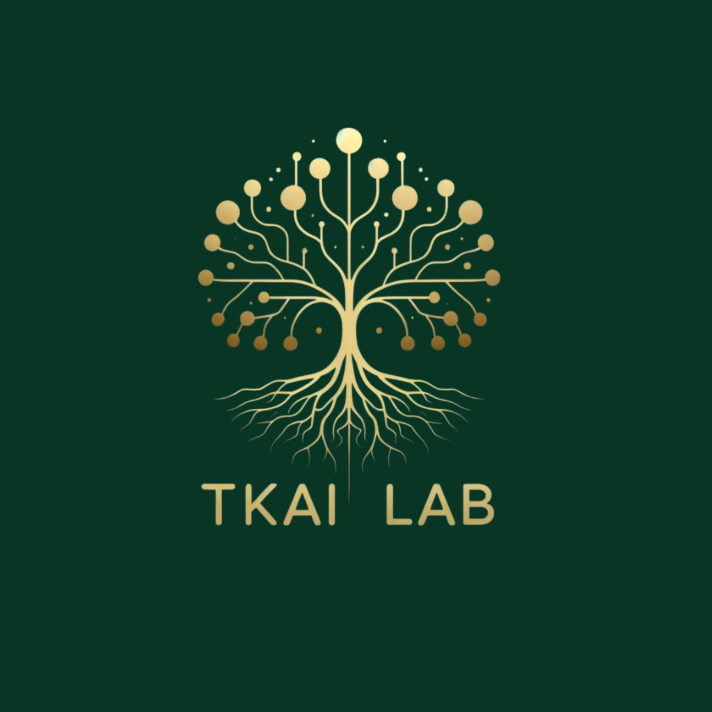

---
hide:
  - navigation
  - toc
---

{ align=left width="250" height="300"}

<!-- # Trustworthy Knowledge-Driven Artificial Intelligence (TKAI) Lab -->

Trustworthy Knowledge-Driven Artificial Intelligence (TKAI) Lab

At the Trustworthy Knowledge Driven Artificial Intelligence (TKAI) Laboratory,
we combine research ideas derived from formal methods, linguistics, cognitive
science, and machine learning to efficiently build intelligent systems that are
trustworthy, ethical, and secure. These models should have a few desired
properties, such as robustness and interpretability, such that humans can
easily understand the generated information. This would mean designing agents
that are expected to learn desirable behavior with minimal supervision and data
that are provably stable and generalize to unseen distribution. We believe
these objectives can be stably achieved by designing knowledge-guided,
neuro-symbolic agents.