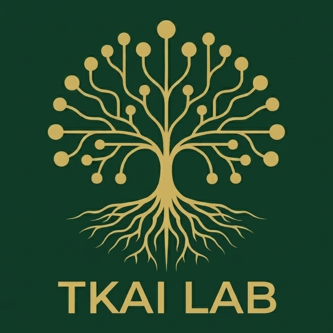

---
hide:
  - navigation
  - toc
---

# Welcome to the Trustworthy Knowledge-Driven AI (TKAI) Lab

At the Trustworthy Knowledge Driven AI (TKAI) Lab, we combine research ideas derived from formal methods, linguistics, cognitive science, and machine learning to efficiently build intelligent systems that are trustworthy, ethical, and secure.

These models should have a few desired properties, such as robustness and interpretability, such that humans can easily understand the generated information. This means designing agents that are expected to learn desirable behavior with minimal supervision and data that are provably stable and generalize to unseen distribution. We believe these objectives can be stably achieved by designing knowledge-guided, neuro-symbolic agents.

  <h2>Our Research</h2>

  <button class="carousel-control prev" aria-label="Previous Slide">
    <svg viewBox="0 0 24 24"><path fill="currentColor" d="M15.41,16.58L10.83,12L15.41,7.41L14,6L8,12L14,18L15.41,16.58Z"/></svg>
  </button>
  <button class="carousel-control next" aria-label="Next Slide">
    <svg viewBox="0 0 24 24"><path fill="currentColor" d="M8.59,16.58L13.17,12L8.59,7.41L10,6L16,12L10,18L8.59,16.58Z"/></svg>
  </button>

  

    

      <!-- Slide 1: Neuro-Mimetic AI -->
      

        

          

            Neuro-Mimetic AI
            <h3>Neuro-Mimetic Approaches</h3>
            
We design brain-inspired computational models that serve as stable, backpropagation-free alternatives to traditional deep learning.

            <ul>
              <li><strong>Predictive Coding</strong>: Self-correcting hierarchical prediction networks that minimize local errors.</li>
              <li><strong>Local Representation Alignment</strong>: Algorithms replacing global gradients with local target representations.</li>
              <li><strong>Memory-Augmented RNNs</strong>: Stable architectures that generalize to longer sequences with finite precision.</li>
            </ul>
          

          

            
            <h4>Key Publications</h4>
            <ul>
              <li><a href="https://arxiv.org/pdf/2308.07870">Predictive Coding Survey (2025)</a></li>
              <li><a href="https://arxiv.org/pdf/2410.04708">PC Stability &amp; Convergence (2024)</a></li>
              <li><a href="https://doi.org/10.1609/aaai.v37i8.26118">Backpropagation-Free LRA (2023)</a></li>
              <li><a href="https://doi.org/10.1016/j.ins.2023.120034">Provably Stable Neural Turing Machine (2024)</a></li>
            </ul>
          

        

      

      <!-- Slide 2: AI for Science -->
      

        

          

            AI for Science
            <h3>AI for Scientific Discovery</h3>
            
We leverage machine learning to accelerate discoveries and solve complex optimization challenges in physical and biological systems.

            <ul>
              <li><strong>Enzyme-Substrate Affinity</strong>: Using protein language models and graph neural networks to predict kinetics (Kcat).</li>
              <li><strong>Physics-Informed Neural Networks</strong>: Design of predictive-coding-based PINNs to capture high-frequency oscillations.</li>
            </ul>
          

          

            
            <h4>Key Publications</h4>
            <ul>
              <li><a href="https://pmc.ncbi.nlm.nih.gov/articles/PMC11844551/pdf/nihpp-2025.02.10.637555v1.pdf">Enzyme Kinetics with RealKcat (2025)</a></li>
            </ul>
          

        

      

      <!-- Slide 3: Neuro-Symbolic LLMs -->
      

        

          

            Neuro-Symbolic LLMs
            <h3>Reasoning &amp; Generalization</h3>
            
We bridge connectionist language models with symbolic systems to construct interpretable, robust, and provably stable agents.

            <ul>
              <li><strong>Local RetoMaton</strong>: Task-adaptive Weighted Finite Automata (WFA) replacing global search for structured retrieval.</li>
              <li><strong>LLM Generalization</strong>: Minimum Description Length (MDL) and curvature analysis to optimize model selection.</li>
            </ul>
          

          

            
            <h4>Key Publications</h4>
            <ul>
              <li><a href="https://openreview.net/pdf?id=ySTqCi3nqi">Neuro-Symbolic Local RetoMaton (2025)</a></li>
              <li><a href="https://arxiv.org/pdf/2603.00910">LLM Optimization Curvature (2026)</a></li>
              <li><a href="https://aclanthology.org/2025.emnlp-main.675.pdf">Pedagogical Teacher/Student LLMs (2025)</a></li>
            </ul>
          

        

      

      <!-- Slide 4: Theoretical Foundations -->
      

        

          

            Theoretical Foundations
            <h3>Theory &amp; Physical Constraints</h3>
            
We study the mathematical limits of computation and information theory under realistic thermodynamic constraints.

            <ul>
              <li><strong>Surprisal-Rényi Free Energy (SRFE)</strong>: A risk-sensitive free energy interpolating forward and reverse KL.</li>
              <li><strong>Realizable Circuit Complexity</strong>: Circuit design constraints modeling heat dissipation and physical space routing.</li>
            </ul>
          

          

            
            <h4>Key Publications</h4>
            <ul>
              <li><a href="https://arxiv.org/pdf/2603.03405">Surprisal-Rényi Free Energy (2026)</a></li>
              <li><a href="https://arxiv.org/pdf/2509.19161">Realizable Circuit Complexity (2025)</a></li>
            </ul>
          

        

      

    

  

  

    
    
    
    
  

  

    <a href="research/" class="research-explore-btn">Explore Our Research</a>
  

## Latest News

April 2026
Internship

**Hitesh Vaidya** accepted a Time-Series Foundation Models Research Intern position at GE Vernova for summer 2026.

January 2026
Acceptance

Raul Castillo and Abdul-Malik Zekri got their work *"The Alpha-Divergence Connection Between Contrastive Representation Learning and the Free Energy Principle"* accepted at the 2026 Florida Undergraduate Research Conference (FURC 2026)!

December 2025
Presentation

Benjamin Prada presented ["Realizable Circuit Complexity: Embedding Computation in Space-Time"](https://arxiv.org/abs/2509.19161v3) at the NeurIPS 2025 Workshop (What Can't Transformers Do?).

December 2025
Presentation

Raul Castillo and Abdul-Malik Zekri presented *"The 'Surprisal' Between Contrastive Representation Learning and the Free Energy Principle"* at the 1st Bellini College REU Symposium (BCRS 2025).

October 2025
Publication

A paper on predictive coding survey with Karl Friston and Rajesh Rao got accepted in **Neural Networks** journal.

September 2025
Acceptance

One paper accepted in **NeurIPS 2025 workshop** (Circuit Complexity From Physical Constraints) – Congratulations Benjamin!

September 2025
Acceptance

One paper accepted in **EMNLP 2025 (main)** – *"Investigating Pedagogical Teacher and Student LLM Agents: Genetic Adaptation Meets Retrieval Augmented Generation Across Learning Style"* – Congratulations to students and collaborators.

<a href="news/">View All News →</a>

<h2 class="cta-title">Join Our Lab</h2>

We are actively seeking motivated graduate and undergraduate students interested in trustworthy machine learning, neuro-symbolic AI, and cognitive models.

If you want to build intelligent agents that are robust, interpretable, and provably stable, explore our open positions and research goals.

<a href="join/" class="cta-button">Apply / Contact Us</a>

