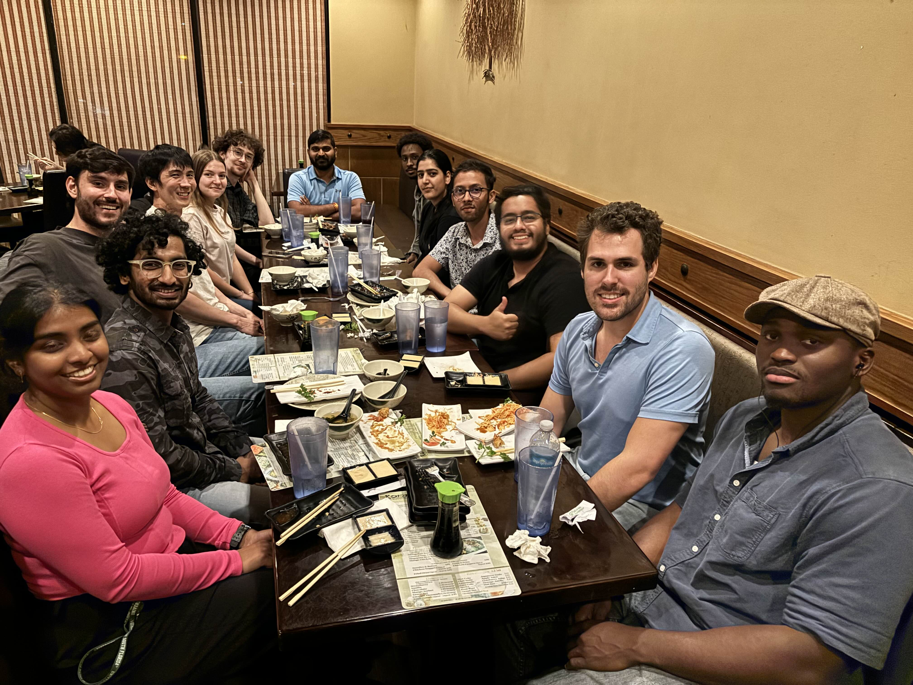
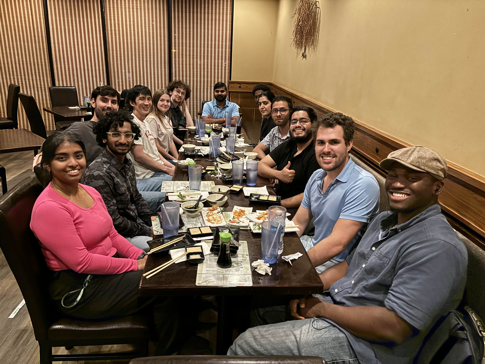
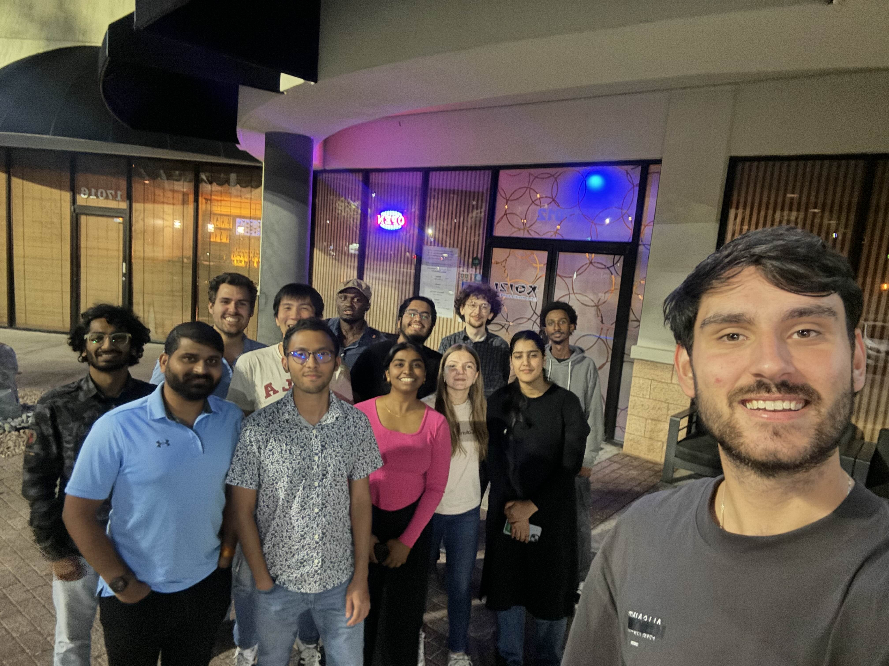
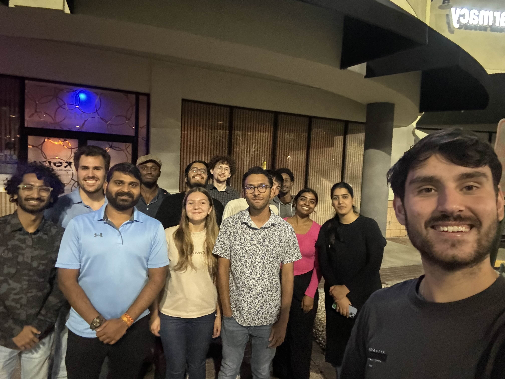
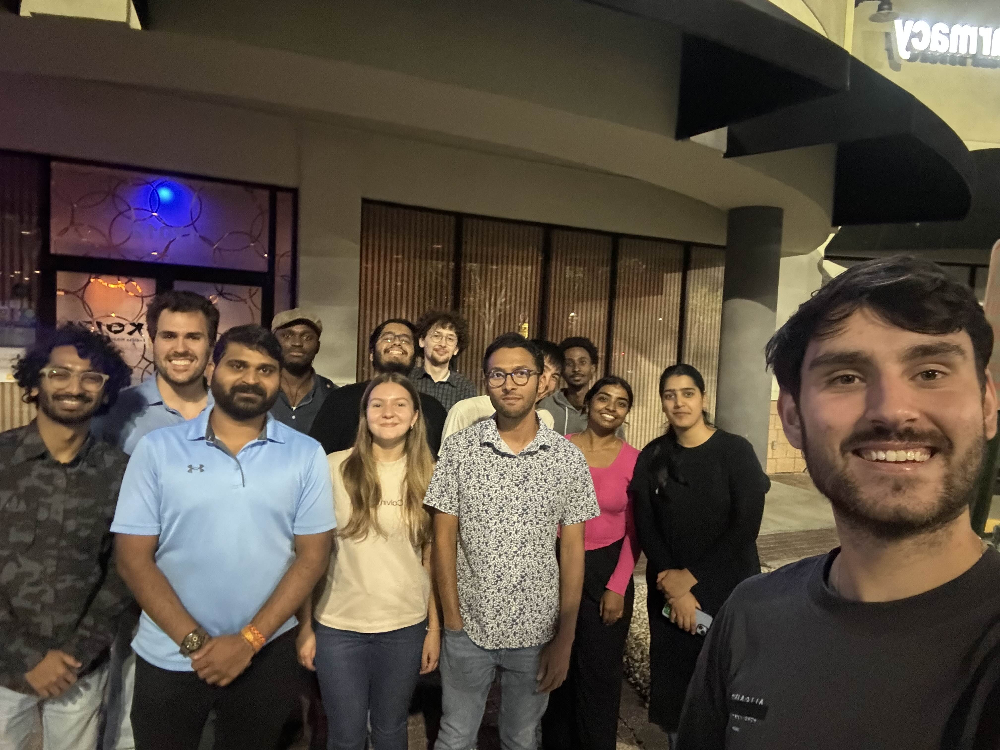
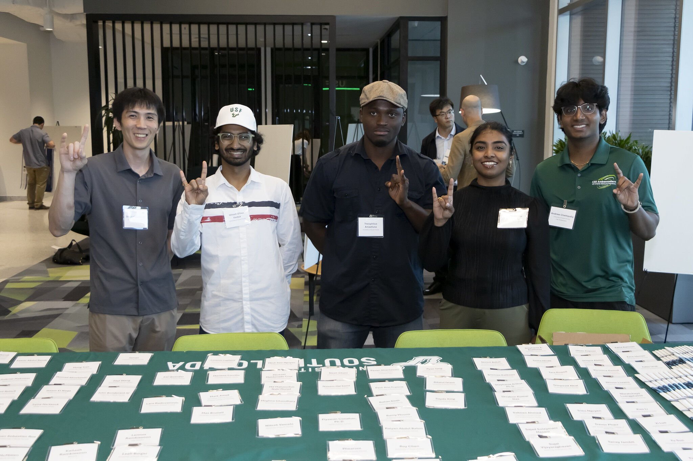
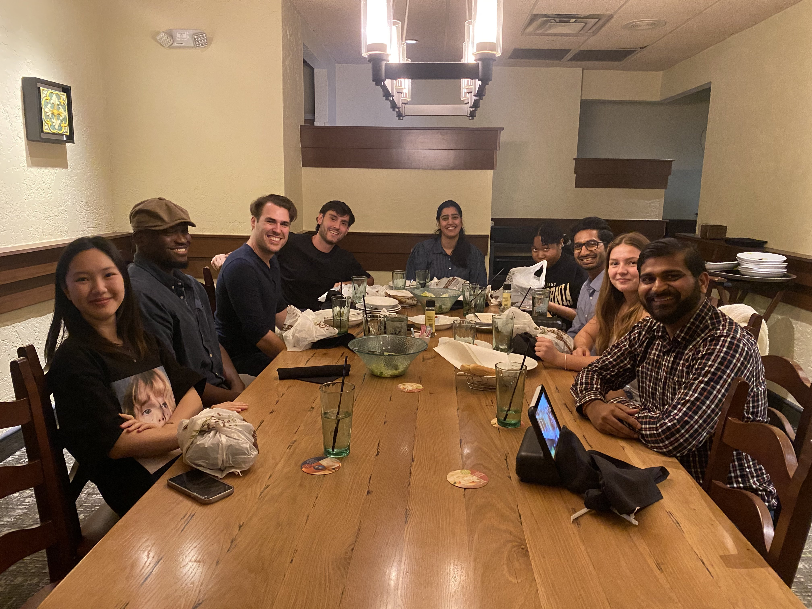
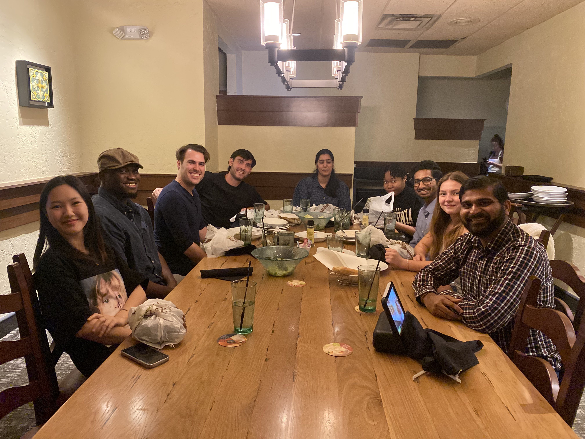
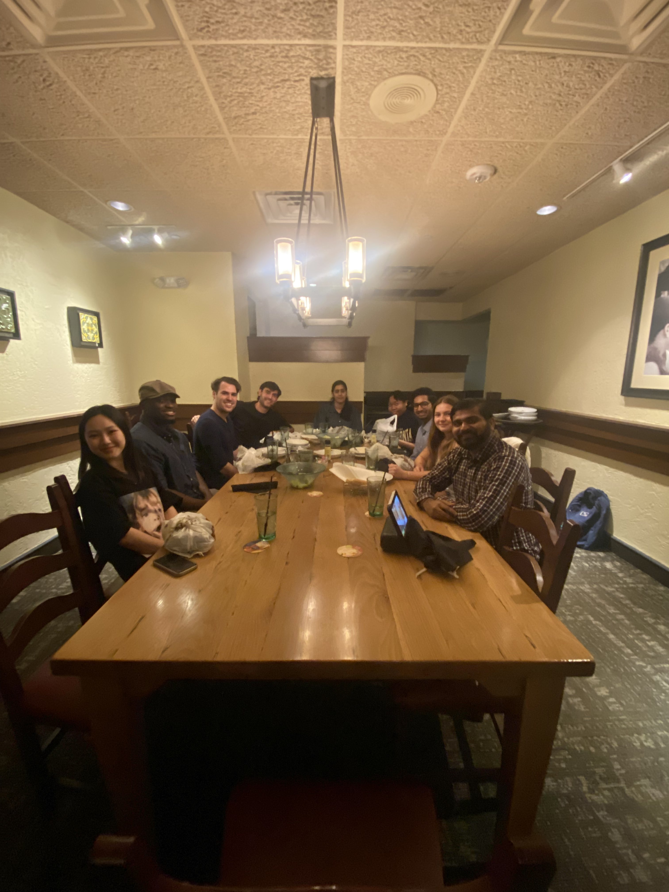
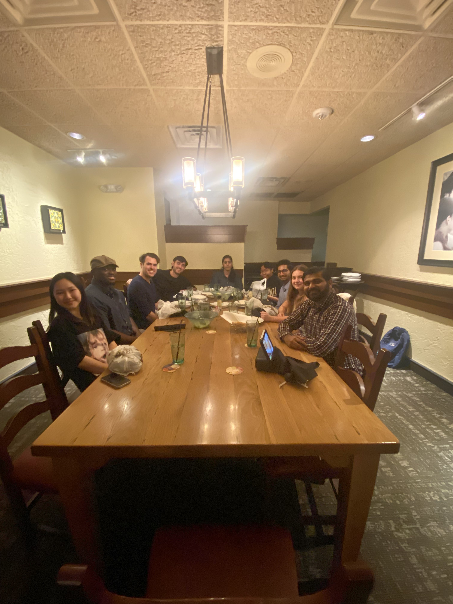

---
hide:
  - navigation
  - toc
---
## 2024
<body>
  

    <button class="arrow left" onclick="previousImage()">&#8592;</button>
    

      
      
      
      
      
      
      
    

    <button class="arrow right" onclick="nextImage()">&#8594;</button>
  

  
</body>

## 2023
<body>
  

    <button class="arrow left" onclick="previousImage()">&#8592;</button>
    

      
      
      
      
      
      
    

    <button class="arrow right" onclick="nextImage()">&#8594;</button>
  

  
</body>