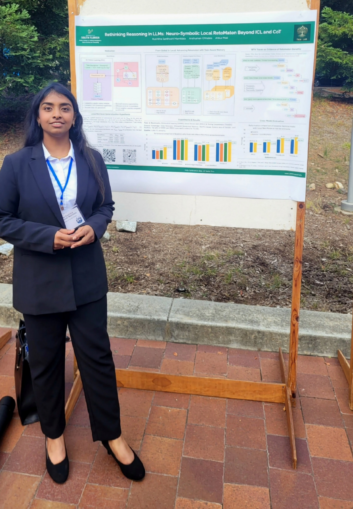
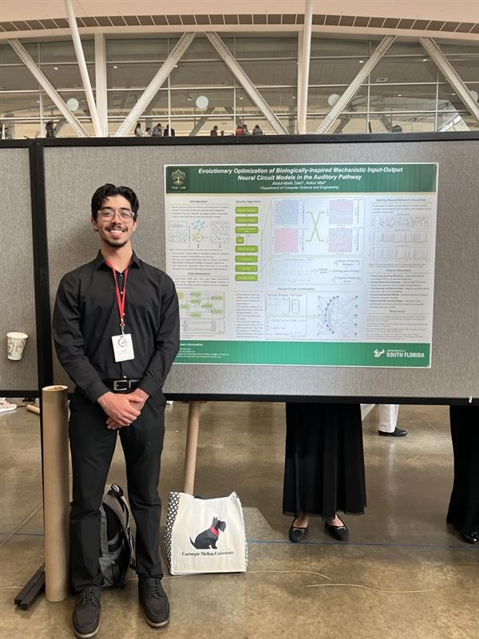

# News & Achievements

Welcome to our lab's news page! Here you'll find the latest updates on our research milestones, student achievements, publications, awards, and other exciting developments from the TKAI Lab.

---

## 2025

### December 2025

**🎤 Conference Presentations** 

Raul Castillo and Abdul-Malik Zekri presented "The 'Surprisal' Between constrastive Representation Learning and the Free Energy Principle" at the 1st Bellini College REU Symposium (BCRS 2025). 

{ width="400"}

### October 2025

**📚 Research Publications**

- One paper accepted in **Neural Networks** - predictive coding survey with Karl Friston and Rajesh Rao

### September 2025

**🏆 Conference Acceptances**

- One paper accepted in **NeurIPS 2025 workshop** - Circuit Complexity From Physical Constraints: Scaling Limitations of Attention - Congratulations **Benjamin**!
- One paper accepted in **EMNLP 2025 (main)** - ["Investigating Pedagogical Teacher and Student LLM Agents: Genetic Adaptation Meets Retrieval Augmented Generation Across Learning Style"](https://scholar.google.co.in/citations?view_op=view_citation&hl=en&user=ogxlzgcAAAAJ&sortby=pubdate&citation_for_view=ogxlzgcAAAAJ:vV6vV6tmYwMC) - Congratulations to students and collaborators.

**🎤 Conference Presentations** 

Rushitha Santhoshi Mamidala presented "*Rethinking Reasoning in LLMs: Neuro-Symbolic Local RetoMaton Beyond ICL and CoT*" at the 19th International Conference on Neuro-Symbolic Learning and Reasoning (NeSy 2025) — delivered both oral and poster presentations.

{ width="300" }

### July 2025

**🎤 Invited Presentations**

- TKAI lab was invited to present work "Bridging Neural and Symbolic Computation: A Learnability Study of RNNs on Counter and Dyck Languages" by Thomas Lukasiewicz group university of Vienna

**📝 Conference Papers**

- Two more papers accepted into **NeSy 2025**:
  - "Neuro‑Symbolic Data Collection Automata for Training Language Models on Edge Devices" with colleagues from Drexel University
  - "Bridging Neural and Symbolic Computation: A Learnability Study of RNNs on Counter and Dyck Languages" in collaboration with Penn State

**🎓 Student Achievement**

- **Rushitha Santhoshi Mamidala**'s Master's thesis titled "*Rethinking Reasoning in LLMs: Neuro-Symbolic Local RetoMaton Beyond ICL and CoT*" has been accepted to the NeSy 2025 conference for both an oral and a poster presentation.

### June 2025

**🎤 Conference Presentations**

- Dr. Mali and Colleague presented "Empirical and Computational Advances in Enzyme Kinetics Prediction: A Machine Learning Approach to Catalytic Variability" in international metabolic engineering society

**🏆 Prestigious Award**

- Dr. Mali and his colleagues won prestigious "**2025 ARMA rock mechanics research award**" for their paper "Crustal Permeability Generated Through Microearthquakes is Constrained by Seismic Moment, Nature Communications, 15:2057"

**🎓 PhD Defense Success**

- **Congratulations Dr. Neisarg Dave** for successfully defending his PhD Thesis - Dr. Dave was co-advised by Dr. Mali and will join ADP as Research Scientist.

### May 2025

**🎤 Panel Participation**

- Dr. Mali was invited as panelist at USF AMP conference (https://www.theampconference.com/agenda/session/1624886)

**📝 Conference Acceptance**

- One paper accepted in **IEEE International Conference on Smart Computing**

**🏆 Student Award**

- Undergraduate researcher **Shrabon Das** won USF CSE UG Award

### April 2025

**🏆 Student Research Excellence**

- **Abdul-Malik Zekri** presented a poster at the 2025 OneUSF Undergraduate Research Conference, won the 2025 Undergraduate Research - General Disciplinary Student Award, and was recognized at the USF Student Research Awards Luncheon.

{ width="400" }

- **Abdul-Malik Zekri** presented a poster at the 2025 National Conference on Undergraduate Research (NCUR) titled *"Evolutionary Optimization of Biologically-Inspired Mechanistic Input-Output Neural Circuit Models in the Auditory Pathway."* The project used custom genetic algorithms to evolve spiking neural circuits based on empirical input-output data.

{ width="300" }

### March 2025

**🏆 National Scholarship**

- **Abdul-Malik Zekri** was awarded the **Barry Goldwater Scholarship**, a nationally prestigious scholarship recognizing outstanding undergraduate researchers in STEM fields, for work spanning biologically-inspired neural circuit modeling with Dr. Ankur Mali to semi-automated mitochondria segmentation workflows in collaboration with Dr. George Spirou's Auditory Development and Connectomics Lab.

### February 2025

**🔬 Research Program**

- **Abdul-Malik Zekri** was accepted to the **Cold Spring Harbor Laboratory (CSHL) Undergraduate Research Program (URP)** for Summer 2025. He will work under Dr. Anthony Zador on a project developing a general model of neuromodulation in neural networks.

### January 2025

**🎉 Student Internships**

- **Yusra Rasool** secured an internship position at Nucor as data intern in the Business development Team.
- **Zhanna Sergeeva** secured an internship position at Dell as a software Engineer.

---

*Last updated: October 2025* 
