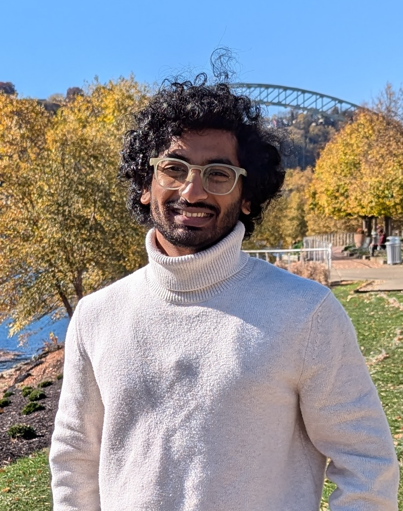
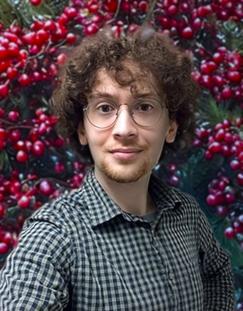
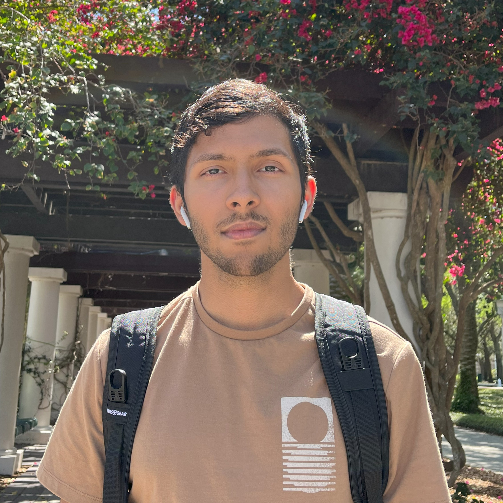

---
hide:
  - navigation
  - toc
---

Principal Investigator - Professor Ankur Mali

<!-- { align=left width="300" height="400"} -->

<!-- ### Prof. Ankur Mali -->
<!-- 

Prof. Ankur Mali completed his Ph.D. under Prof. Clyde Lee Giles from The Pennsylvania State University in 2022. He works at the intersection of language, memory, and computation—spanning Natural Language Processing (NLP), linguistics, and formal language theory.

Furthermore, he has also designed approaches to investigate the mysterious success of deep learning in recognizing natural language from a theoretical and empirical perspective. He also works on designing learning algorithms and computational neural architectures guided by theories of the brain. These architectures focus on solving challenges such as continual/lifelong learning, learning with minimal supervision, Reinforcement Learning, and robustness (both in computer vision and natural language processing).

 -->

  
  

    
Professor Ankur Mali completed his Ph.D. under Professor Clyde Lee Giles from The Pennsylvania State University in 2022. He works at the intersection of language, memory, and computation—spanning natural language processing, linguistics, and formal language theory.

    
    
Furthermore, he has also designed approaches to investigate the mysterious success of deep learning in recognizing natural language from a theoretical and empirical perspective. He also works on designing learning algorithms and computational neural architectures guided by theories of the brain. These architectures focus on solving challenges such as continual/lifelong learning, learning with minimal supervision, Reinforcement Learning, and robustness (both in computer vision and natural language processing).

    
    

      
      
      
      
      
    

  

<!-- { align=left width="400" height="200" }

Dr. Ankur Mali completed his Ph.D. under Prof. Clyde Lee Giles from The
Pennsylvania State University in 2022. He works at the intersection of
language, memory, and computation—spanning Natural Language Processing (NLP),
linguistics, and formal language theory. Furthermore, he has also designed
approaches to investigate the mysterious success of deep learning in
recognizing natural language from a theoretical and empirical perspective. He
also works on designing learning algorithms and computational neural
architectures guided by theories of the brain. These architectures focus on
solving challenges such as continual/lifelong learning, learning with minimal
supervision, Reinforcement Learning, and robustness (both in computer vision
and natural language processing). -->

## PhD Students

  
Hitesh Vaidya

  

  
  

    Continual Learning, Bio-mimetic Machine Learning  
    loves running, yoga and travelling
  

  

    
    <a href="https://hiteshvaidya.github.io" title="Website"> <!-- website link -->
      
    </a>
    
    
    
  

  
Theophilus Amaefuna

  

  
  

    Research Assistant, CSE 
    Predictive coding, Natural Language Processing  
  

  

    
    <!--  -->
    <!--  -->
    
    
  

  
Shion Matsumoto

  

  
  

    Research Assistant, CSE 
    Bioinspired learning, physics-informed neural networks
  

  

    
    <!--<a href="https://yourwebsite.com" title="Website">-->
    <!--  -->
    <!--</a>-->
    
    
    
  

  
Benjamin Prada

  

  
  

    Research Assistant, CSE 
    Neural program synthesis, expressability & learnability
  

  

    
    <!--<a href="https://yourwebsite.com" title="Website">-->
    <!--  -->
    <!--</a>-->
    
    
    <!--<a href="https://scholar.google.com/citations?user=yourprofile" title="Google Scholar">-->
    <!--  -->
    <!--</a>-->
  

## Master's Students

  
Alfredo Fernandez

  

  
  

    Research Assistant, CSE 
    Deep Learning, Applied Mathematics
  

  

    
    <!--  -->
    
    
    
  

  
Sree Rushitha Santhoshi Mamidala

  

  
  

    Research Assistant, CSE 
    Natural Language Processing
  

  

    
    <!--  -->
    
    
    <!--  -->
  

  
Tahsun Rahman Khan

  

  
  

    Research Assistant, CSE 
    Deep Learning
  

  

    
    <!--  -->
    
    
    <!--  -->
  

  
abc

  

  
  

    Research Assistant, CSE 
    Short bio here
  

  

    
    
    
    
    
  

## Undergraduate Students

  
Yusra

  

  
  

    Research Assistant, CSE 
    Short bio here
  

  

    
    
    
    
    
  

  
Zhanna

  

  
  

    Research Assistant, CSE 
    Short bio here
  

  

    
    
    
    
    
  

  
Mustafa Mannan

  

  
  

    Research Assistant, CSE 
    Tackling challenges in neural network learnability and stability 
  

  

    
    
    
    
    
  

  
Shrabon Kumar Das

  

  
  

    Research Assistant, CSE 
    Investigating learnability and expressivity of neural architectures
  

  

    
    <!--  -->
    
    
    
  

## Alumni

### PhD students

- [Neisarg Dave](https://www.neisargdave.com), advised by [Dr. C. Lee Giles](https://clgiles.ist.psu.edu), [Dr. Dan Kifer](https://www.cse.psu.edu/~duk17/), Dr. Ankur Mali
- [Haiwen Guan](https://scholar.google.com/citations?user=TfhgkD4AAAAJ&hl=en), advised by [Dr. C. Lee Giles](https://clgiles.ist.psu.edu) and Dr. Ankur Mali
- Alex Bi, advised by [Dr. Parisa Shokouhi](https://sites.psu.edu/ultrasonics/pshokouhi/) and Dr. Ankur Mali

### Graduate students

- [Thejasvi Valega](https://github.com/thejasvi204), advised by [Dr. Parisa Shokouhi](https://sites.psu.edu/ultrasonics/pshokouhi/) and Dr. Ankur Mali
- Sudarshan Nayak, advised by [Dr. Dan Kifer](https://www.cse.psu.edu/~duk17/), [Dr. Parisa Shokouhi](https://sites.psu.edu/ultrasonics/pshokouhi/), and Dr. Ankur Mali
