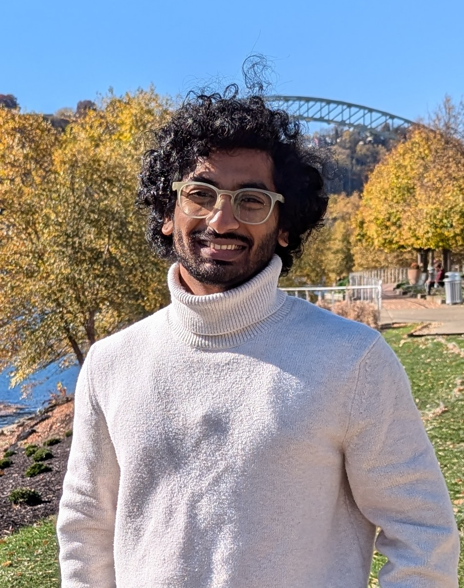

---
hide:
  - navigation
  - toc
---

Principal Investigator - Prof. Ankur Mali

<!-- { align=left width="300" height="400"} -->

<!-- ### Prof. Ankur Mali -->
<!-- 

Prof. Ankur Mali completed his Ph.D. under Prof. Clyde Lee Giles from The Pennsylvania State University in 2022. He works at the intersection of language, memory, and computation—spanning Natural Language Processing (NLP), linguistics, and formal language theory. 

Furthermore, he has also designed approaches to investigate the mysterious success of deep learning in recognizing natural language from a theoretical and empirical perspective. He also works on designing learning algorithms and computational neural architectures guided by theories of the brain. These architectures focus on solving challenges such as continual/lifelong learning, learning with minimal supervision, Reinforcement Learning, and robustness (both in computer vision and natural language processing).

 -->

  
  

    
Prof. Ankur Mali completed his Ph.D. under Prof. Clyde Lee Giles from The Pennsylvania State University in 2022. He works at the intersection of language, memory, and computation—spanning Natural Language Processing (NLP), linguistics, and formal language theory.

    
    
Furthermore, he has also designed approaches to investigate the mysterious success of deep learning in recognizing natural language from a theoretical and empirical perspective. He also works on designing learning algorithms and computational neural architectures guided by theories of the brain. These architectures focus on solving challenges such as continual/lifelong learning, learning with minimal supervision, Reinforcement Learning, and robustness (both in computer vision and natural language processing).

    
    

      
      
      
      
      
    

  

<!-- { align=left width="400" height="200" }

Dr. Ankur Mali completed his Ph.D. under Prof. Clyde Lee Giles from The
Pennsylvania State University in 2022. He works at the intersection of
language, memory, and computation—spanning Natural Language Processing (NLP),
linguistics, and formal language theory. Furthermore, he has also designed
approaches to investigate the mysterious success of deep learning in
recognizing natural language from a theoretical and empirical perspective. He
also works on designing learning algorithms and computational neural
architectures guided by theories of the brain. These architectures focus on
solving challenges such as continual/lifelong learning, learning with minimal
supervision, Reinforcement Learning, and robustness (both in computer vision
and natural language processing). -->

## PhD Students

  
Hitesh Vaidya

  

  
  

    Continual Learning, Bio-mimetic Machine Learning  
    loves running, yoga and travelling
  

  

    
    <a href="https://hiteshvaidya.github.io" title="Website"> <!-- website link -->
      
    </a>
    
    
    
  

  
Theophilus

  

  
  

    Research Assistant, CSE 
    Short bio here
  

  

    
    
    
    
    
  

  
Shion Matsumoto

  

  
  

    Research Assistant, CSE 
    Bioinspired learning
  

  

    
    
    
    
    
  

  
Benjamin Prada

  

  
  

    Research Assistant, CSE 
    Short bio here
  

  

    
    
    
    
    
  

## Graduate Students

  
Sree Rushitha Santhoshi Mamidala

  

  
  

    Research Assistant, CSE 
    Short bio here
  

  

    
    
    
    
    
  

  
abc

  

  
  

    Research Assistant, CSE 
    Short bio here
  

  

    
    
    
    
    
  

  
abc

  

  
  

    Research Assistant, CSE 
    Short bio here
  

  

    
    
    
    
    
  

## Under Graduate Students

  
Yusra

  

  
  

    Research Assistant, CSE 
    Short bio here
  

  

    
    
    
    
    
  

  
Zhanna

  

  
  

    Research Assistant, CSE 
    Short bio here
  

  

    
    
    
    
    
  

  
abc

  

  
  

    Research Assistant, CSE 
    Short bio here
  

  

    
    
    
    
    
  

<!-- 

-   Hitesh Vaidya
  
    ---

  { align=center width="200" }
     
    PhD Student, CSE  
    hvaidya@usf.edu  
    Continual Learning, Bio-mimetic Machine Learning

-   Theophilus

    ---

    { align=left width="200" }

    Research Assistant, CSE

-   Shion Matsumoto

    ---

    { align=left width="200" }

    Research Assistant, CSE

    matsumoto@usf.edu

    Bioinspired learning

-   Benjamin Prada

    ---

    { align=left width="200" }

    Research Assistant, CSE

## Master's Students

-   Alfredo

    ---

    { align=left width="200" }

    Research Assistant, CSE

-   Gerardo

    ---

    { align=left width="200" }

    Research Assistant, CSE

-   Rushitha

    ---

    { align=left width="200" }

-   Tahsun

    ---

    { align=left width="200" }

    Research Assistant, CSE

## Undergraduate Students

-   Shrabon

    ---

    { align=left width="200" }

    Research Assistant, CSE

-   Zhanna

    ---

    { align=left width="200" }

    Research Assistant, CSE

-   Mustafa

    ---

    { align=left width="200" }

    Research Assistant, CSE

-   Yusra

    ---

    { align=left width="200" }

    Research Assistant, CSE

 -->

## Alumni
..