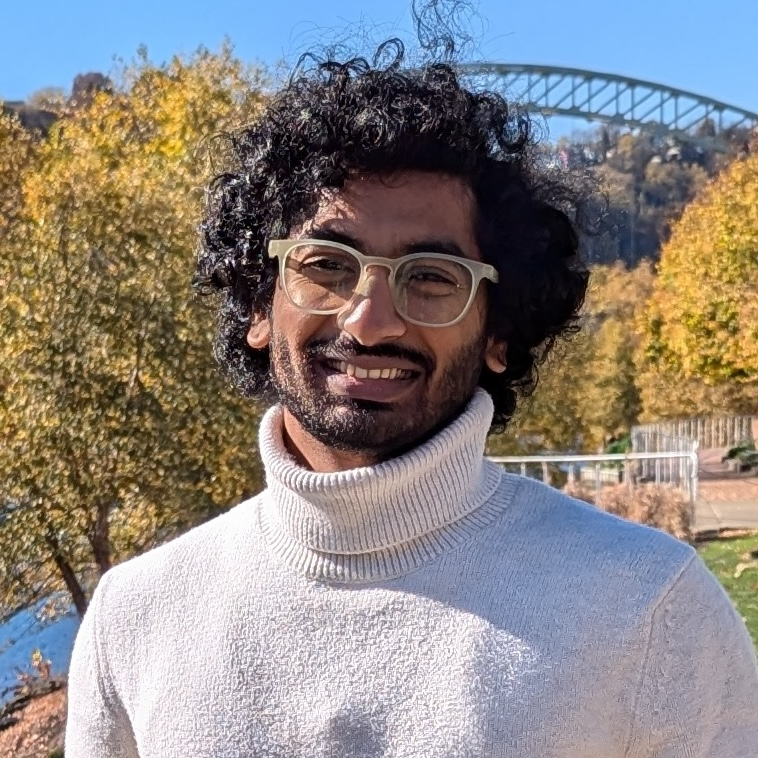
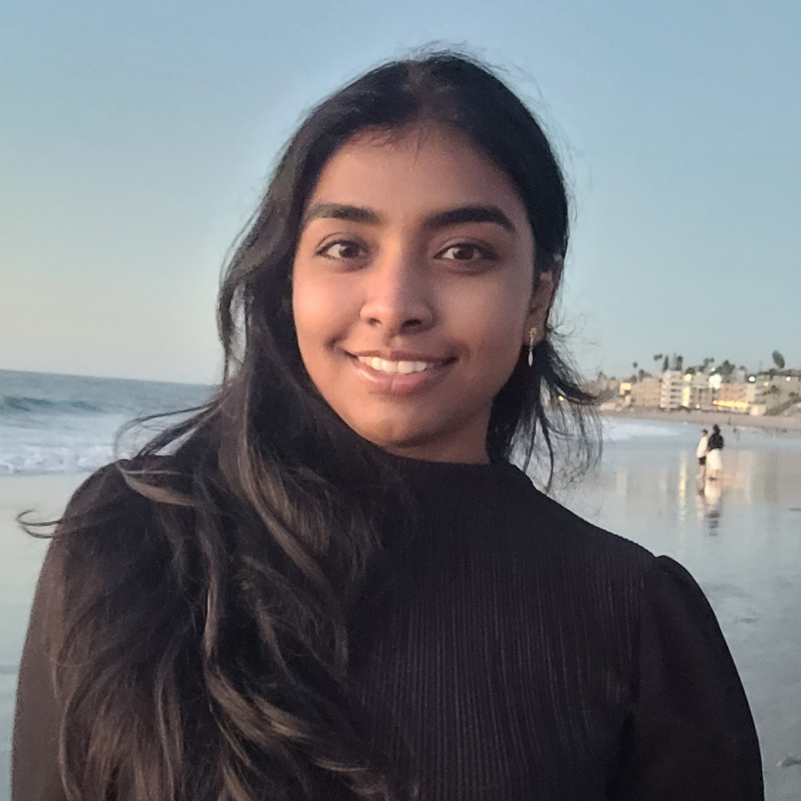
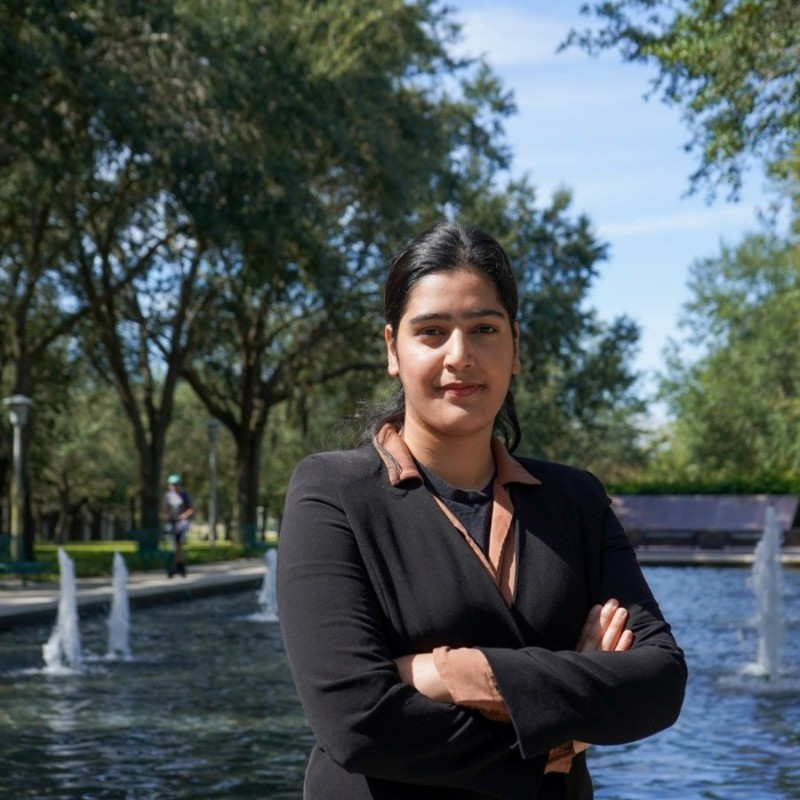

---
hide:
  - navigation
  - toc
---

<!-- markdownlint-disable-file MD033 MD024-->

# People

## Principal Investigator

Professor Ankur Mali

  
  

    
Professor Ankur Mali completed his Ph.D. under Professor Clyde Lee Giles from The Pennsylvania State University in 2022. He works at the intersection of language, memory, and computation—spanning natural language processing, linguistics, and formal language theory.

    
Furthermore, he has also designed approaches to investigate the mysterious success of deep learning in recognizing natural language from a theoretical and empirical perspective. He also works on designing learning algorithms and computational neural architectures guided by theories of the brain. These architectures focus on solving challenges such as continual/lifelong learning, learning with minimal supervision, reinforcement learning, and robustness (both in computer vision and natural language processing).

    

      
      
      
      
    

  

## PhD Students

  
Hitesh Vaidya

  

  
  

    Computer Science & Engineering 
    Continual Learning, Bio-mimetic Machine Learning 
    hvaidya [at] usf [dot] edu
  

  

    <a href="https://hiteshvaidya.github.io" title="Website"> <!-- website link -->
      
    </a>
    
    
    
  

  
Theophilus Amaefuna

  

  
  

    Computer Science & Engineering 
    Predictive coding, NLP 
    ikennaamaefuna [at] usf [dot] edu
  

  

    
    
  

  
Shion Matsumoto

  

  
  

    Computer Science & Engineering  
    Bio-inspired learning, PINNs 
    matsumoto [at] usf [dot] edu
  

  

    
    
    
  

  
Benjamin Prada

  

  
  

    Computer Science & Engineering  
    Neural program synthesis, expressability & learnability 
    bprada [at] usf [dot] edu
  

  

    
    
  

  
Sree Rushitha Santhoshi Mamidala

  

  
  

    Computer Science & Engineering  
    Neuro-symbolic Language Models, NLP 
    sreerushitha [at] usf [dot] edu 
  

  

    
    
    
  

## Undergraduate Students

  
Yusra Rasool

  

  
  

    Computer Science & Engineering  
    yrasool [at] usf [dot] edu 
  

  

    
    
    
  

## Alumni

### PhD Students

- [Neisarg Dave](https://www.neisargdave.com), advised by [Dr. C. Lee Giles](https://clgiles.ist.psu.edu), [Dr. Dan Kifer](https://www.cse.psu.edu/~duk17/), Dr. Ankur Mali
- [Haiwen Guan](https://scholar.google.com/citations?user=TfhgkD4AAAAJ&hl=en), advised by [Dr. C. Lee Giles](https://clgiles.ist.psu.edu) and Dr. Ankur Mali
- Alex Bi, advised by [Dr. Parisa Shokouhi](https://sites.psu.edu/ultrasonics/pshokouhi/) and Dr. Ankur Mali

### Master's Students

- [Joo-Young Gonzalez](https://www.linkedin.com/in/jooyoung-gonzalez/), advised by Dr. Ankur Mali
- [Tahsun Rahman Khan](https://www.linkedin.com/in/tahsun-rahman-khan-b94641214/), advised by Dr. Ankur Mali
- [Thejasvi Valega](https://github.com/thejasvi204), advised by [Dr. Parisa Shokouhi](https://sites.psu.edu/ultrasonics/pshokouhi/) and Dr. Ankur Mali
- Sudarshan Nayak, advised by [Dr. Dan Kifer](https://www.cse.psu.edu/~duk17/), [Dr. Parisa Shokouhi](https://sites.psu.edu/ultrasonics/pshokouhi/), and Dr. Ankur Mali
- [Alfredo Fernandez](https://www.linkedin.com/in/alfredofernandezjr/), advised by Dr. Ankur Mali.
- Gerardo Wibmer, advised by Dr. Ankur Mali

### Undergraduate Students

- [Abdul-Malik Zekri](https://www.linkedin.com/in/abdul-malik-zekri/), PhD student at Harvard University, advised by Dr. Ankur Mali
- [Raul Castillo](http://www.linkedin.com/in/raul-castillo-215485213), advised by Dr. Ankur Mali
- [Zhanna Sergeeva](https://www.linkedin.com/in/zhannasergeeva/), advised by Dr. Ankur Mali
- [Tasnia Simin](https://www.linkedin.com/in/tasnia-mahsin-simin/), advised by Dr. Ankur Mali
- [Shrabon Kumar Das](https://www.linkedin.com/in/shrabon-kumar-das-25564621a/), advised by Dr. Ankur Mali
- [Mustafa Mannan](https://linkedin.com/in/mustafa-mannan), advised by Dr. Ankur Mali
