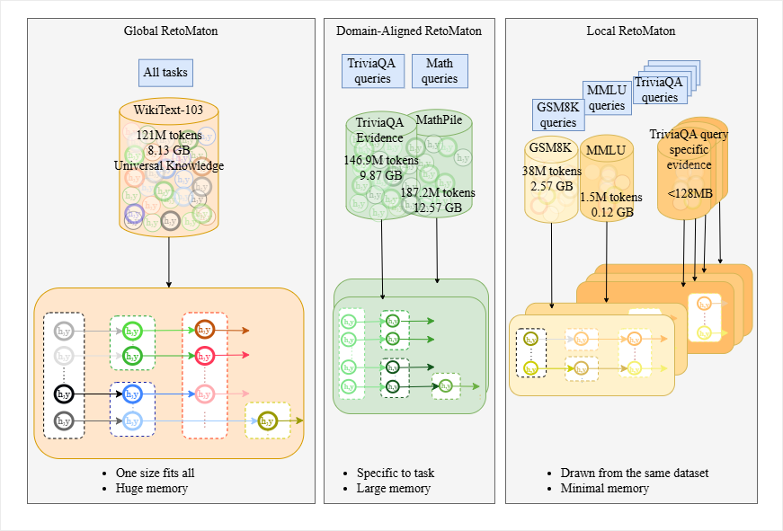

# Projects

At the TKAI Lab, our mission is to develop stable AI systems by integrating insights from neuroscience, control theory, advanced physics, formal methods, and cognitive science. By combining theoretical foundations with empirical validation, we aim to pioneer stability-driven methodologies. Our focus is on creating systems that demand minimal supervision, leverage smaller datasets, and remain computationally efficient. Above all, we strive to ensure these systems are both explainable and trustworthy, paving the way for reliable and transparent AI solutions.

<!-- At TKAI Lab, we recognize that stability and trustworthiness must be built on a solid theoretical foundation. Formal methods form the backbone of our research, enabling us to ensure that our AI systems are reliable, transparent, and verifiable in both theory and practice. -->
<!-- We develop rigorous mathematical frameworks to analyze and guarantee the stability of AI systems. Our theoretical work bridges the gap between foundational research and real-world applications, ensuring our methods are robust under a variety of conditions. -->
<!-- To validate our theoretical models, we conduct comprehensive empirical studies. These experiments test the applicability and scalability of our methods in real-world scenarios, ensuring that our stability-driven AI systems perform reliably under diverse and challenging conditions. -->

## AI for Science

We are committed to harnessing the power of AI to revolutionize other scientific domains. At TKAI Lab, we explore the intersection of AI with physics, biology, cybersecurity, health and cognitive science to address some of the most complex interdisciplinary challenges. Our aim is to create transformative solutions that are explainable, efficient, and trustworthy, pushing the boundaries of both AI and the sciences it touches.

### Enzyme-Substrate Affinity Prediction

  

    
  

  

    The interaction between protein (enzyme) and substrate is a complex reaction that depends on the 3D geometry of protein and bond strength at individual sights of protein. The prediction of binding between enzyme and substrate involves challenges like development of protein embedding space, pooling with minimal information loss and position based binding affinity prediction. We are interested in predicting the binding affinity of enzyme-substrate complexes (Kcat) using protein language models and graph neural networks.
  

<!-- ### DNA Subsequence Alignment

  
No Image Available

  

    DNA subsequences are long chains of nucleotides with unique geometric and semantic structure. We are using seq-to-seq models to compare DNA subsequences and find the closest matching pair from a vector store database.
  

 -->

## Neuro-Mimetic Approaches

At TKAI Lab, we are inspired by the remarkable efficiency and adaptability of biological systems. Our work focuses on integrating neuro-mimetic principles into AI to develop stable, adaptive, and efficient systems capable of tackling real-world challenges. By fusing insights from neuroscience, control theory, and cognitive science, we aim to create AI systems that emulate human-like learning and decision-making.

<!-- ### Reinforcement Learning

  
No Image Available

  

    We explore cutting-edge reinforcement learning techniques that emulate the way biological systems learn through interaction and feedback. Our focus is on developing stable, efficient agents that require minimal data and supervision, while still making optimal decisions in complex environments.
  

### Continual Learning

  
No Image Available

  

    Taking inspiration from the brain’s ability to learn incrementally, we develop systems that can seamlessly acquire new knowledge without losing previously learned information. This ensures robust adaptability and stability, enabling AI to thrive in dynamic, real-world settings.
  

### Alternative to Backpropagation

  
No Image Available

  

    Challenging the limitations of traditional backpropagation, we are pioneering alternative training methods inspired by neurobiological and control-theoretic principles. These approaches aim to reduce computational overhead, improve energy efficiency, and enhance system stability while maintaining or exceeding current performance benchmarks.
  

### Predictive Coding

  
No Image Available

  

    Predictive coding is a cornerstone of our research, drawing from the brain’s ability to minimize prediction errors. This approach enables the design of AI systems that are not only computationally efficient but also adaptive, allowing them to learn and respond in real time with greater precision and stability.
  

 -->

### Scaling Predictive Coding

  
No Image Available

  

    Machine learning has been a field of significant scientific progress in recent years. The backbone of this progress has been the backpropagation (backprop) algorithm, which computes the gradient with respect to the loss at the end of these machine learning models. Each model parameter is updated based on the derivative of the loss with respect to that parameter to reduce the overall loss, thereby fostering learning, provided the loss is differentiable with respect to that parameter. Despite the successes, the backprop algorithm is said to be biologically implausible since it is unlikely that learning in the brain is done based on some global loss.
      
    Rather, the brain constructs a model of the world and corrects this model by minimising the overall prediction error. This prediction error is hierarchical in nature and hence local. The predictive Coding (PC) framework proposes a biologically plausible alternative to learning. In its classical formulation, it models the brain’s localised and hierarchical error correction. Getting PC right means we come closer to understanding how perception and learning are achieved by the brain. In its success, the PC algorithm has failed to scale in size while remaining stable.
    Our goal is to achieve the scalability of the PC algorithm to make it a stronger alternative to backprop, giving strong empirical backing to the already strong theoretical foundation of the PC framework.
  

### Local Representation Alignment

  
No Image Available

  

    Modern machine learning is primarily driven by the Backpropagation (backprop) algorithm; however, it is widely considered biologically implausible because it requires a global loss signal and symmetrical weight transposes. Local Representation Alignment (LRA-E) serves as a biologically motivated alternative that replaces global gradients with local target representations and error matrices (E) that learn to approximate weight transposes through a co-learning rule. Our work focuses on developing a generalized LRA-E framework capable of supporting an arbitrary number of layers and architecture depths for autoencoders, moving beyond fixed-depth classification models to allow for complex hierarchical feature learning. We are currently extending this scalable framework to Variational Autoencoders (VAEs), addressing the specific challenges of noisy reparameterization gradients and the inherent mathematical shrinkage bias found in local target correction formulas. Our goal is to demonstrate that local learning rules can scale to deep generative architectures while maintaining performance comparable to traditional backpropagation.
      
    We are also exploring ways of using LRA to train Recurrent Neural Networks. RNNs fail to train for long horizon tasks due to vanishing or exploding gradients. To tackle this problem we fuse a fast and slow update mechanism and train the network over windows of long horizon input. The slow states update using backpropagation through time (BPTT) and within these slow states there are recursive subnetworks trained using LRA. As a result, the total loss is calculated using summation of losses obtained from BPTT, LRA and task based loss. We are currently testing this mechanism on five different tasks like copy, adding, temporal order, permuted mnist, sequential mnist against standard RNNs and LSTMs
  

### Memory-Augmented Neural Networks

  
No Image Available

  

    The Transformer has dominated the modern field of machine learning in various domains; however, they have failed to maintain their expected performance when evaluated on inputs that are longer than those in the training data. When evaluated on synthetic tasks involving the Chomsky hierarchy, Transformers (and other sequence-based architectures such as recursive neural networks and LSTMs) have struggled to generalize to strings longer than those seen in training. Recent work, has shown that extending these architectures with an external memory, broadly referred to as memory-augmented neural networks (MANNs), have shown promise in addressing this fundamental limitation.
      
    Our work is focused on developing MANNs that outperform state-of-the-art architectures on formal and general language tasks, whilst maintaining comparable levels of computational complexity.
  

## Theory

### Surprisal-Rènyi Free Energy

  

    
  

  

    Despite sharing the same minimizer, the forward and reverse Kullback-Leibler (KL) divergences induce different inductive biases, commonly referred to as mean-seeking and mode-seeking behavior, respectively. There exist divergences that bridge this asymmetry, such as the Jensen-Shannon divergence and the Cressie-Read power divergence family. However, these attempts either fail to simultaneously enforce both mass- and mean-covering behaviors under certain scenarios or fail to capture higher-order behaviors (such as variance or tail-sensitivity) in ways that could improve learning outcomes.
      
    We propose the Surprisal-Rènyi Free Energy (SRFE) as a risk-sensitive functional able that interpolates the forward and reverse KL divergences via a single scalar parameter. We show that SRFE recovers the forward and reverse KL divergences as endpoint limits and derived second-order expansions around the limits that contain the variance of the log-likelihood ratio as a first-order correction. This reveals a sensitivity to mean-variance tradeoffs in SRFE. We further establish that SRFE's gradient form improves gradient conditioning in the almost disjoint regime where classical f-divergences lead to diverging behavior. Finally, we interpret SRFE through the lens of coding theory and show that SRFE penalizes rare but extreme miscalibration events (the model assigns exponentially too little probability to actual outcomes).
      
    In our future work, we are interested in demonstrating the effectiveness of SRFE as an objective by conducting empirical experiments on tasks where robustness to outliers is critical.
  

### Realizable Circuit Complexity

  
No Image Available

  

    Historically, computational complexity has been defined only in terms of the logical depth of the function as realized by a circuit or other device. However, this treatment ignores the challenge of routing the information through physical space, dissipating heat, and other physical considerations. As a result, classical theory is agnostic of the real-world cost of function implementation and thus often over-estimates the performance of a deployed system. We reformulate standard circuit complexity research under conservative physical constraints that lower bound the time complexity of a given function by any conceivable device, classical or quantum. In particular, we explicitly define the regimes where computation is bottlenecked by memory throughput, sequential dependencies, and heat dissipation. This perspective shift places hardware as a first-class citizen for theoretical computer science and enables the discovery of targeted practical results.
  

## LLMs

### Local RetoMaton

  

    
  

  

    Prompt-based reasoning strategies such as Chain-of-Thought (CoT) and In-Context Learning (ICL) are widely used to elicit reasoning in LLMs, but they rely on fragile prompt dynamics that often produce inconsistent and opaque outputs. To address this limitation, we extend the automata-based neuro-symbolic framework RetoMaton by replacing its global datastore with a local, task-adaptive Weighted Finite Automaton (WFA) constructed from domain-specific corpora. This local automaton provides structured, deterministic retrieval that improves interpretability, robustness, and task alignment while maintaining low inference overhead. We evaluate the approach by augmenting LLaMA-3.2-1B and Gemma-3-1B-PT on TriviaQA, GSM8K, and MMLU, demonstrating consistent improvements over the base models and prompting-based reasoning methods. Our results show that automaton-guided symbolic memory offers a more transparent and reliable alternative to prompt-based reasoning for domain-aware LLM inference. This method is described in <a href="https://openreview.net/forum?id=ySTqCi3nqi">this paper</a>.
  

### Exploring generalization, capacity and learnability of LLMs

  
No Image Available

  

    Empirical results have shown that LLMs perform better with large parameter space. However, the mechanics of LLMs are governed by multiple factors like inference cost, capacity, number of parameters and training algorithm. We need theoretical methods to uncover the black box mechanism of language models to understand their learnability, model parameters and generalization. Minimum description length is one of the domains that can help us with model selection strategies. It also be used to understand the loss landscape of model, noise learned in the representation and the immunization of model towards parameter pruning and perturbation. We explore ways in which we can understand and build closed form solutions for model selection strategies and measure their generalization ability.
  

## Others

We additionally are have worked on projects beyond ML and have highlighted them here.

### Parallel Bounded Multi-Source Shortest Path

  
No Image Available

  

    <em>Field: High performance computing</em>   

    Dijkstra's algorithm is the gold standard for solving the shortest path problem (SSP); i.e., finding the shortest path between a node on a directed graph to all other nodes. However, in 2025 Duan et al. developed "Bounded Multi-source Shortest Path" (BMSSP): the first SSP algorithm with time complexity $\mathcal{O}(E \log^{(2/3)} V)$, strictly lower than Dijkstra's $\mathcal{O}(E + V \log V)$ for sparse graphs. Compared to Dijkstra's, BMSSP is also well-suited for parallelization because it is designed to separate the search into independent sub-problems.
      
    We are currently creating the first parallel implementation of BMSSP for execution on GPUs. We aim to probe the limits of the BMSSP algorithm and determine whether it can outperform industry-grade SSP solutions.
  

### Gradient Descent-Based Model Reference Adaptive Control

  

    
  

  

    <em>Field: Control systems</em>   

    In the command-following problem, model reference adaptive control (MRAC) is a class of well-known control architectures that are capable of tuning control parameters online without explicit knowledge of the system's uncertainties. By construction, MRAC is able to track time-varying control signals; however, they suffer from increase controller order and the dimensionality of the gain matrices. Gradient descent-based MRAC (GD-MRAC) addressed this issue by employing a gradient descent-based approach to minimize the error between the time rate of change of the reference model state and a given command signal to track. As a natural continuation of this work, we are interested in extending GD-MRAC to make use of higher-order optimization methods to further improve tracking performance and evaluate its performance on real-world systems with the added pressures of increased noise and computational constraints.
  

