# Research

The Trustworthy Knowledge-Driven AI (TKAI) Lab develops stable, explainable, and trustworthy AI systems by integrating ideas from neuroscience, formal language theory, control theory, information theory, scientific machine learning, and cognitive science. Our research combines **mathematical foundations** with **empirical validation**, with the goal of building AI systems that learn from limited data, remain computationally efficient, generalize beyond training distributions, and provide transparent reasoning.

Our work spans five major directions: **brain-inspired learning**, **neural automata and theoretical AI**, **neuro-symbolic reasoning and trustworthy language models**, **AI for scientific discovery**, and **AI for health, biology, and vision**.

---

## Brain-Inspired Learning and Predictive Coding

At TKAI Lab, we study learning algorithms inspired by biological intelligence. A central goal is to move beyond purely global backpropagation-based training by developing local, stable, and energy-based learning mechanisms.

- **Predictive Coding**

    ---

    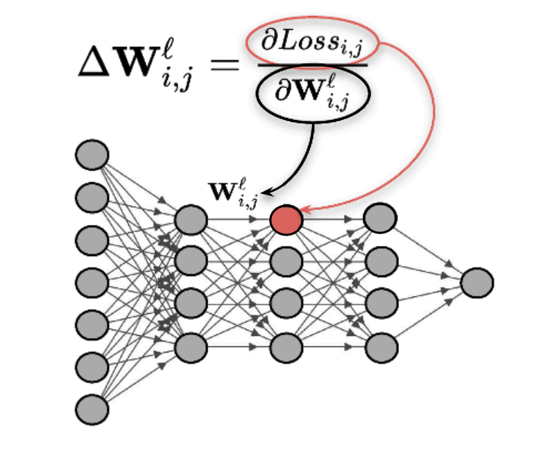

    === "Overview"
        Predictive coding models learning as an iterative process in which internal states are adjusted to reduce local prediction errors. We study predictive coding as an alternative framework for scalable deep learning, continual learning, robustness, and energy-based inference. Our work develops stability, convergence, and robustness guarantees for predictive coding networks, while also exploring their relationship to Minimum Description Length (MDL), active inference, and biologically plausible learning.

    === "Publications"
        - [A Survey on Neuro-Mimetic Deep Learning via Predictive Coding (2025)](https://doi.org/10.1016/j.neunet.2025.108161)
        - [Bridging Predictive Coding and MDL: A Two-Part Code Framework for Deep Learning (2025)](https://arxiv.org/pdf/2505.14635)
        - [Tight Stability, Convergence, and Robustness Bounds for Predictive Coding Networks (2024)](https://arxiv.org/pdf/2410.04708)
        - [The Predictive Forward-Forward Algorithm (2023)](https://arxiv.org/pdf/2301.01452)
        - [Convolutional Neural Generative Coding: Scaling Predictive Coding to Natural Images (2023)](https://arxiv.org/pdf/2211.12047)
        - [Lifelong Neural Predictive Coding: Sparsity Yields Less Forgetting When Learning Cumulatively (2022)](https://proceedings.neurips.cc/paper_files/paper/2022/file/26f5a4e26c13d1e0a47f46790c999361-Paper-Conference.pdf)

- **Local Representation Alignment**

    ---

    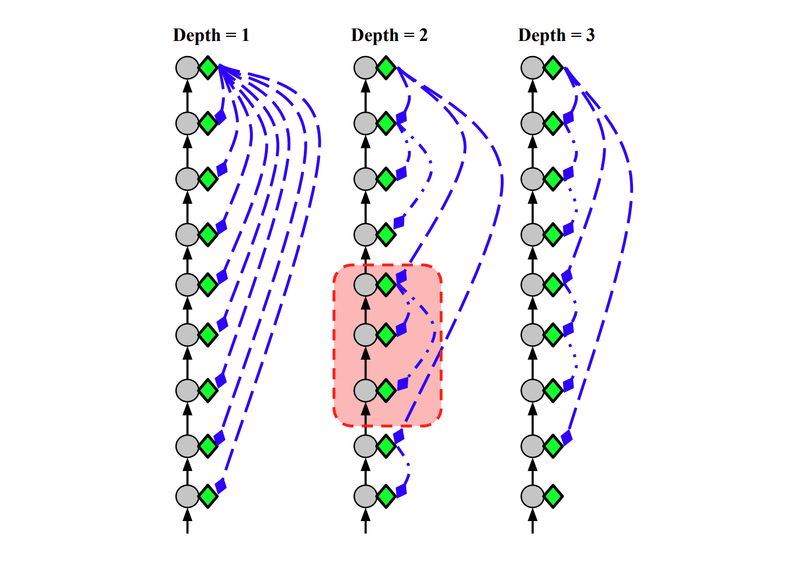

    === "Overview"
        Local Representation Alignment (LRA) replaces global error propagation with locally defined target representations and feedback pathways. This line of work studies how deep and recurrent networks can learn using local objectives, error-feedback matrices, and layer-wise alignment mechanisms. We use LRA to understand alternatives to backpropagation in feedforward networks, recurrent models, compression systems, and continual learning.

    === "Publications"
        - [Backpropagation-Free Deep Learning with Recursive Local Representation Alignment (2023)](https://doi.org/10.1609/aaai.v37i8.26118)
        - [Continual Learning of Recurrent Neural Networks by Locally Aligning Distributed Representations (2020)](https://doi.org/10.1109/TNNLS.2019.2953622)
        - [Conducting Credit Assignment by Aligning Local Representations (2018)](https://arxiv.org/pdf/1803.01834)
        - [Biologically Motivated Algorithms for Propagating Local Target Representations (2019)](https://cdn.aaai.org/ojs/4389/4389-13-7428-1-10-20190706.pdf)

- **Backpropagation-Free Reinforcement Learning**

    ---

    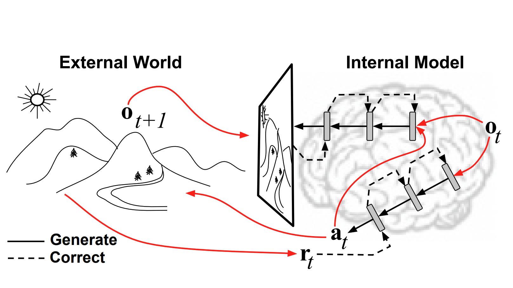

    === "Overview"
        We explore reinforcement learning systems that use active neural generative coding and predictive coding instead of standard backpropagation through time. These models are motivated by the idea that agents can learn through local predictive objectives, internal state correction, and action-conditioned generative dynamics. This research connects predictive coding, active inference, and reinforcement learning in sparse-reward robotic control settings.

    === "Publications"
        - [Active Predictive Coding: Brain-Inspired Reinforcement Learning for Sparse Reward Robotic Control Problems (2023)](https://doi.org/10.1109/ICRA48891.2023.10160530)
        - [Backprop-Free Reinforcement Learning with Active Neural Generative Coding (2022)](https://doi.org/10.1609/aaai.v36i1.19876)

- **Neuro-Mimetic and Continual Learning**

    ---

    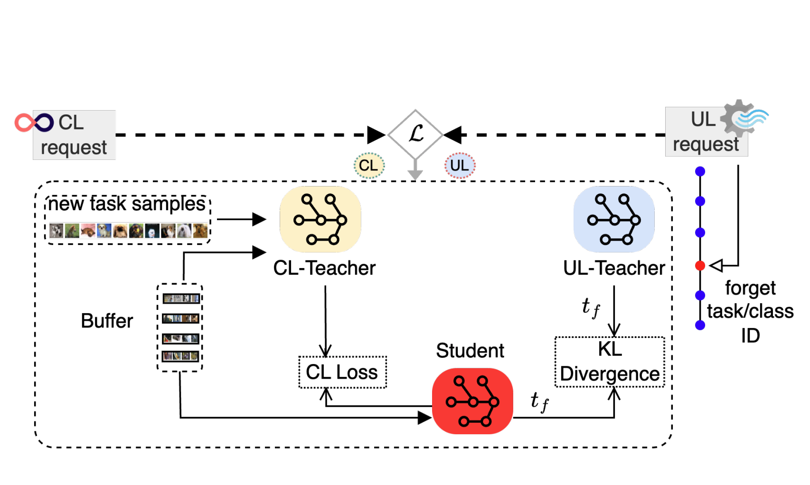

    === "Overview"
        We study how neural systems can learn continually without catastrophic forgetting. This includes predictive coding models, self-organizing maps, local learning, sparse representations, and task-free online learning. The broader goal is to design learning systems that remain adaptive over time while preserving previously acquired knowledge.

    === "Publications"
        - [Neuro-Mimetic Task-Free Unsupervised Online Learning with Continual Self-Organizing Maps (2024)](https://arxiv.org/pdf/2402.12465)
        - [A Unified Framework for Continual Learning and Unlearning (2024)](https://arxiv.org/pdf/2408.11374)
        - [Lifelong Neural Predictive Coding: Learning Cumulatively Online Without Forgetting (2022)](https://proceedings.neurips.cc/paper_files/paper/2022/file/26f5a4e26c13d1e0a47f46790c999361-Paper-Conference.pdf)

---

## Neural Automata, Formal Languages, and Computational Theory

We develop theoretical foundations for understanding what neural networks can learn under finite precision, finite time, and practical computational constraints. This work connects recurrent networks, differentiable memory, automata theory, formal languages, and computational complexity.

- **Memory-Augmented Neural Networks**

    ---

    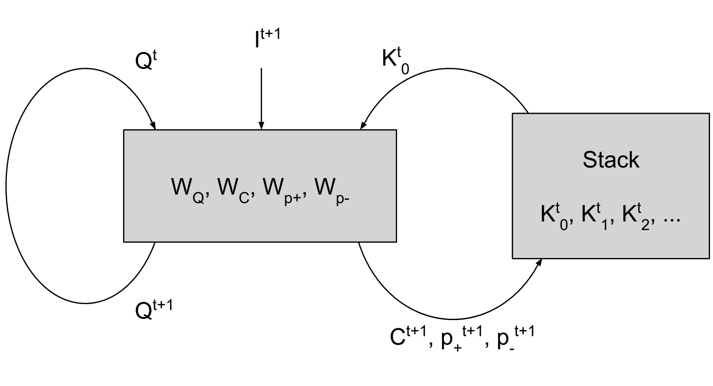

    === "Overview"
        Transformers and recurrent networks often struggle to generalize to sequences longer than those seen during training. Our work develops memory-augmented neural networks, including differentiable stack and tape-based models, to study how neural architectures can recognize formal languages, simulate automata, and perform structured computation under finite precision and time.

    === "Publications"
        - [A Provably Stable Neural Network Turing Machine with Finite Precision and Time (2024)](https://doi.org/10.1016/j.ins.2023.120034)
        - [Exploring Learnability in Memory-Augmented Recurrent Neural Networks: Precision, Stability, and Empirical Insights (2024)](https://arxiv.org/pdf/2410.03154)
        - [Recognizing Long Grammatical Sequences Using Recurrent Networks Augmented with an External Differentiable Stack (2021)](https://proceedings.mlr.press/v153/mali21a.html)
        - [The Neural State Pushdown Automata (2021)](https://doi.org/10.1109/TAI.2021.3055167)

- **Formal Languages and Neural Learnability**

    ---

    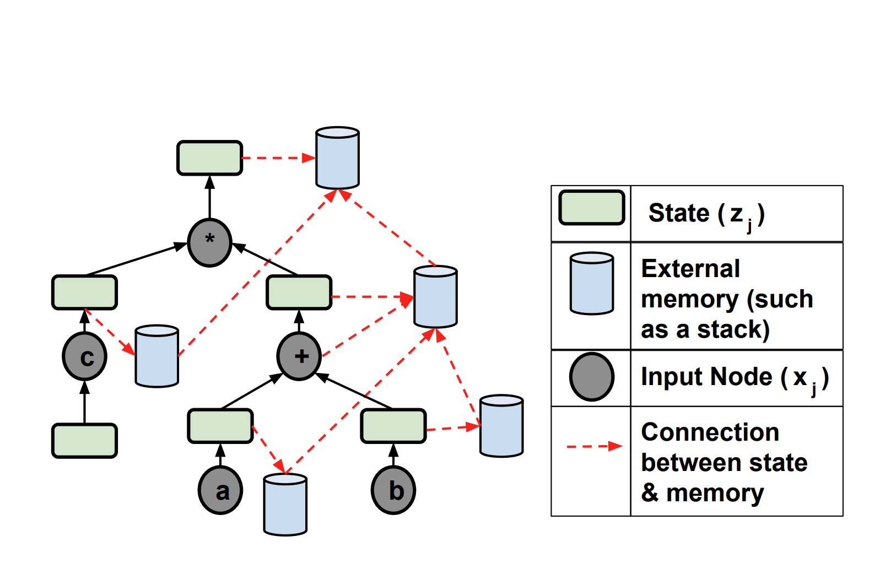

    === "Overview"
        We study recurrent neural networks through the lens of formal language recognition. This includes counter languages, Dyck languages, mathematical equation verification, and symbolic rule extraction. Our goal is to characterize when neural models can learn structured computation and when they collapse to simpler finite-state behavior.

    === "Publications"
        - [Bridging Neural and Symbolic Computation: A Learnability Study of RNNs on Counter and Dyck Languages (2025)](https://proceedings.mlr.press/v284/dave25a.html)
        - [Investigating Backpropagation Alternatives when Learning to Dynamically Count with Recurrent Neural Networks (2021)](https://proceedings.mlr.press/v153/mali21b.html)
        - [Recognizing and Verifying Mathematical Equations Using Multiplicative Differential Neural Units (2021)](https://doi.org/10.1609/aaai.v35i6.16634)
        - [Stability Analysis of Various Symbolic Rule Extraction Methods from Recurrent Neural Network (2024)](https://openreview.net/pdf?id=zFWKKYz2yn)

- **Realizable Circuit Complexity**

    ---

    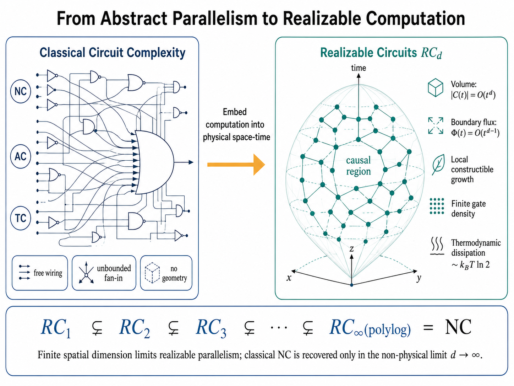

    === "Overview"
        Standard circuit complexity often abstracts away physical constraints such as spatial embedding, communication delay, locality, and energy dissipation. We develop Realizable Circuit Complexity as a framework for understanding computation under physical and architectural constraints. This work provides a new lens for analyzing the limitations of attention, long-range computation, and scalable neural reasoning systems.

    === "Publications"
        - [Realizable Circuit Complexity: Embedding Computation in Space-Time (2025)](https://arxiv.org/pdf/2509.19161)

- **Finite Precision and Computational Limits**

    ---

    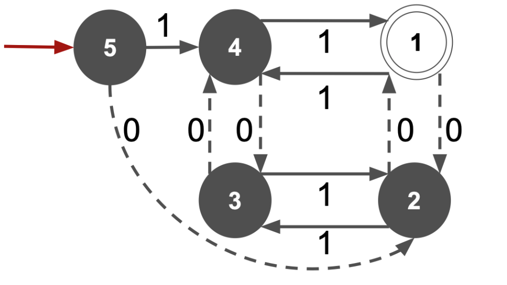

    === "Overview"
        Neural networks are often analyzed as real-valued systems, but practical computation occurs under bounded precision and finite time. We study how these constraints change the expressivity, stability, and learnability of neural architectures. This research asks when neural models can approximate symbolic computation and when numerical constraints force them into simpler computational regimes.

    === "Publications"
        - [Theoretically Deriving Computational Limits of Artificial Neural Networks with Bounded Precision and Time (2022)](https://etda.libraries.psu.edu/files/final_submissions/26802)
        - [On the Computational Complexity and Formal Hierarchy of Second Order Recurrent Neural Networks (2023)](https://arxiv.org/pdf/2309.14691)
        - [On the Tensor Representation and Algebraic Homomorphism of the Neural State Turing Machine (2023)](https://arxiv.org/pdf/2309.14690)

---

## Neuro-Symbolic AI and Trustworthy Language Models

We develop neuro-symbolic methods that combine neural representations with symbolic structure, automata-inspired memory, and interpretable reasoning. This work focuses on making language models more reliable, controllable, and transparent.

- **Local RetoMaton and Neuro-Symbolic Reasoning**

    ---

    

    === "Overview"
        Local RetoMaton extends retrieval-based language modeling with local, structured, automata-inspired memory. Instead of relying only on chain-of-thought prompting or in-context examples, this approach introduces traceable memory paths that can support more transparent and controllable reasoning. Our goal is to develop language models that can expose the reasoning structures they use and allow users to inspect, edit, and verify them.

    === "Publications"
        - [Rethinking Reasoning in LLMs: Neuro-Symbolic Local RetoMaton Beyond CoT and ICL (2025)](https://openreview.net/pdf?id=ySTqCi3nqi)
        - [Neuro‑Symbolic Data Collection Automata for Training Language Models on Edge Devices (2025)](https://openreview.net/pdf?id=wO7CP2lpCJ)
        - [Investigating Symbolic Capabilities of Large Language Models (2024)](https://arxiv.org/pdf/2405.13209)

- **LLM Generalization, Capacity, and MDL**

    ---

    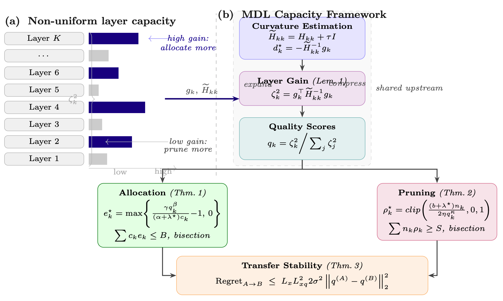

    === "Overview"
        We study large language model capacity, generalization, and optimization through Minimum Description Length, curvature analysis, influence-based layer allocation, and information-theoretic learning principles. This work aims to move model selection and adaptation from heuristic procedures toward principled optimization objectives.

    === "Publications"
        - [Curvature-Weighted Capacity Allocation: A Minimum Description Length Framework for Layer-Adaptive Large Language Model Optimization (2026)](https://arxiv.org/pdf/2603.00910)

- **Educational and Human-Centered LLM Agents**

    ---

    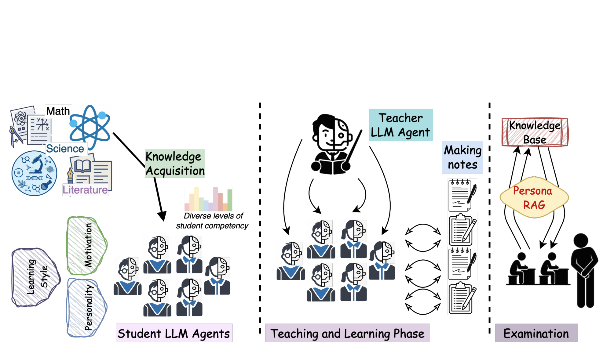

    === "Overview"
        We design LLM-based agents for education and human-centered reasoning. This includes teacher-student agent systems, retrieval-augmented learning environments, learning-style adaptation, and ethically grounded decision-making. The goal is to make AI agents useful, transparent, and safe in settings where human learning and trust are central.

    === "Publications"
        - [Investigating Pedagogical Teacher and Student LLM Agents: Genetic Adaptation Meets Retrieval Augmented Generation Across Learning Style (2025)](https://aclanthology.org/2025.emnlp-main.675.pdf)
        - [Ethical Decision-Making in the Age of AI: An Analysis of Large Language Models (2026)](https://doi.org/10.1109/ACDSA67686.2026.11467880)

---

## Robust, Safe, and Efficient Deep Learning

We develop mathematical and algorithmic tools for improving the stability, robustness, safety, and efficiency of deep learning systems.

- **Activation Functions and Stability Theory**

    ---

    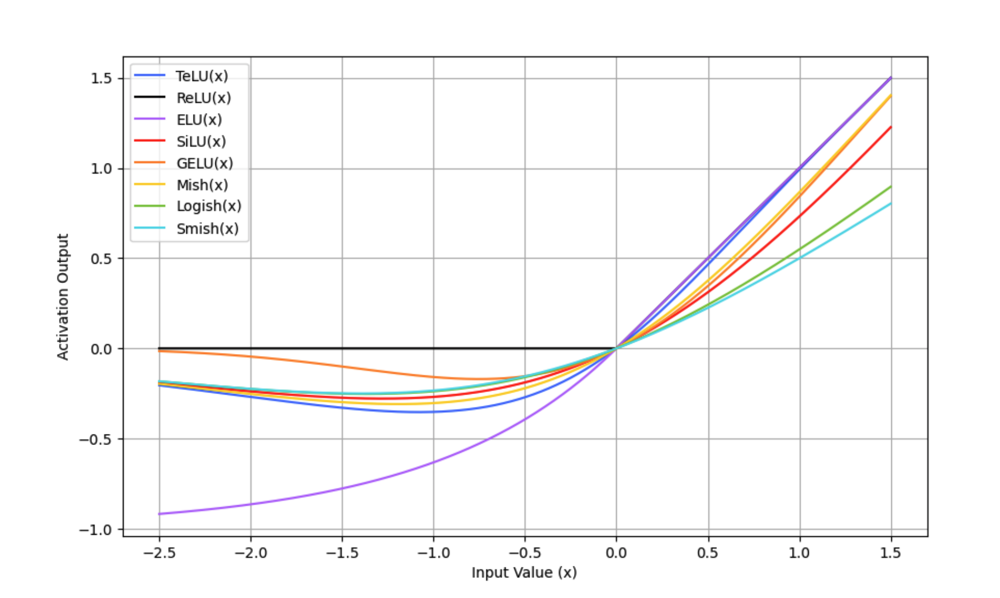

    === "Overview"
        Activation functions shape gradient flow, representation geometry, stability, and optimization dynamics. We study activation functions through theoretical and empirical lenses, including smoothness, asymptotic growth, Gaussian propagation, and stability signatures. This line of work includes the TeLU activation function and a broader 9-dimensional taxonomy for activation-induced behavior in deep networks.

    === "Publications"
        - [TeLU Activation Function for Fast and Stable Deep Learning (2025)](https://arxiv.org/pdf/2412.20269)
        - [Integral Signatures of Activation Functions: A 9-Dimensional Taxonomy and Stability Theory for Deep Learning (2025)](https://arxiv.org/pdf/2510.08456)

- **Information-Theoretic and MDL-Based Learning**

    ---

    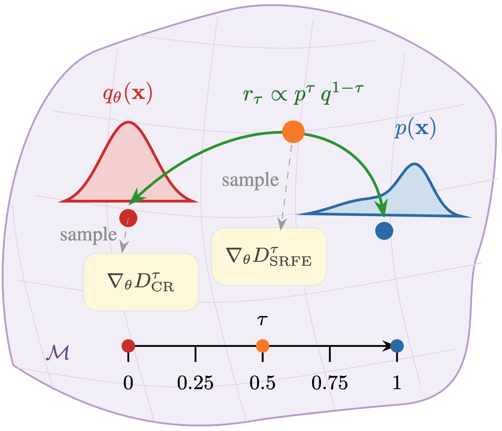

    === "Overview"
        We develop learning objectives based on information theory, free energy, and Minimum Description Length. These methods aim to improve robustness, calibration, and model selection by penalizing overly complex explanations and rare but severe failure modes. Surprisal-Rényi Free Energy provides a risk-sensitive objective that interpolates between different divergence behaviors.

    === "Publications"
        - [Surprisal-Rényi Free Energy (2026)](https://arxiv.org/pdf/2603.03405)
        - [Bridging Predictive Coding and MDL: A Two-Part Code Framework for Deep Learning (2025)](https://arxiv.org/pdf/2505.14635)
        - [Curvature-Weighted Capacity Allocation for LLM Optimization (2026)](https://arxiv.org/pdf/2603.00910)

- **Robustness, Continual Learning, and Unlearning**

    ---

    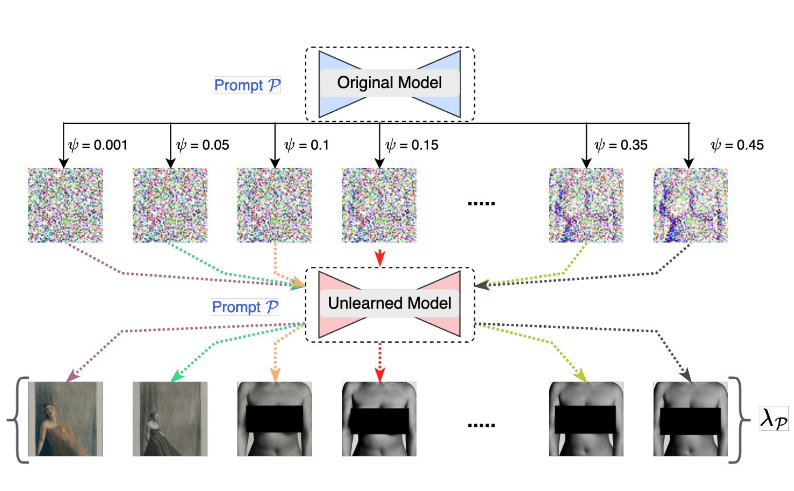

    === "Overview"
        Reliable AI systems must adapt, forget, and remain robust under distribution shifts and adversarial conditions. We study continual learning, model unlearning, concept erasure, and robustness in generative models. This research develops evaluation methods and divergence-driven objectives for distinguishing true unlearning from concealment or superficial suppression.

    === "Publications"
        - [A Unified Framework for Continual Learning and Unlearning (2024)](https://arxiv.org/pdf/2408.11374)
        - [Unlearning or Concealment? A Critical Analysis and Evaluation Metrics for Unlearning in Diffusion Models (2024)](https://arxiv.org/pdf/2409.05668)
        - [Towards Robust Concept Erasure in Diffusion Models: Unlearning Identity, Nudity and Artistic Styles (2024)](https://openreview.net/pdf?id=Ox2A1WoKLm)
        - [Beyond L2: Divergence-Driven Concept Unlearning in Diffusion Models](https://ssrn.com/abstract=5705580)

---

## AI for Scientific Discovery

We use AI to accelerate scientific discovery in biology, geoscience, physics, and engineering. Our emphasis is on models that combine data-driven learning with scientific structure, domain knowledge, and interpretable constraints.

- **Enzyme Kinetics and Protein Function Prediction**

    ---

    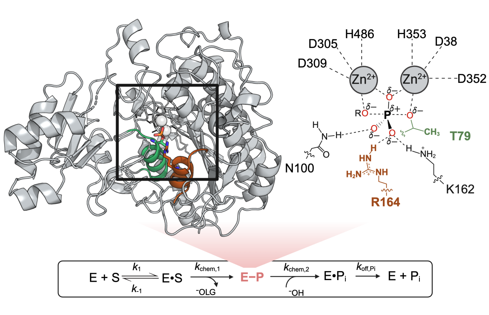

    === "Overview"
        Enzyme-substrate interactions depend on protein sequence, molecular structure, substrate chemistry, and local binding geometry. We develop machine learning models for enzyme kinetics and catalytic variability using protein language models, substrate representations, and graph-based learning. This research supports biological discovery, metabolic engineering, and enzyme design.

    === "Publications"
        - [Robust Prediction of Enzyme Variant Kinetics with RealKcat (2025)](https://pmc.ncbi.nlm.nih.gov/articles/PMC11844551/pdf/nihpp-2025.02.10.637555v1.pdf)
        - [Empirical and Computational Advances in Enzyme Kinetics Prediction: A Machine Learning Approach to Catalytic Variability (2025)](https://aiche.confex.com/aiche/me16/meetingapp.cgi/Paper/707843)

- **Physics-Guided Machine Learning for Earthquake Prediction**

    ---

    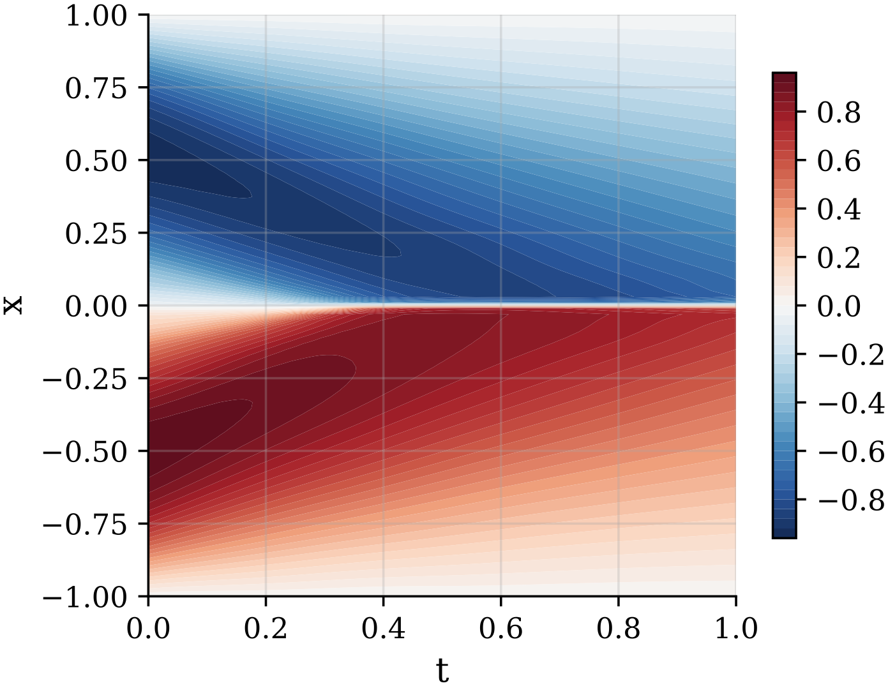

    === "Overview"
        We develop physics-guided machine learning models for laboratory earthquake prediction and fault-zone monitoring. This work combines active-source ultrasonic measurements, physics-informed learning, and geophysical domain knowledge to model frictional failure, permeability evolution, and acoustic precursors to lab earthquakes.

    === "Publications"
        - [Using a Physics-Informed Neural Network and Fault Zone Acoustic Monitoring to Predict Lab Earthquakes (2023)](https://doi.org/10.1038/s41467-023-39377-6)
        - [Physics-Guided Machine Learning for Laboratory Earthquake Prediction (2023)](https://doi.org/10.5194/egusphere-egu23-15437)
        - [A Physics-Informed Machine Learning Model for Lab Earthquake Prediction Using Time-Lapse Active Source Ultrasonic Data (2022)](https://agu.confex.com/agu/fm22/meetingapp.cgi/Paper/1177419)

- **Geoscience, Permeability, and Seismo-THMC Systems**

    ---

    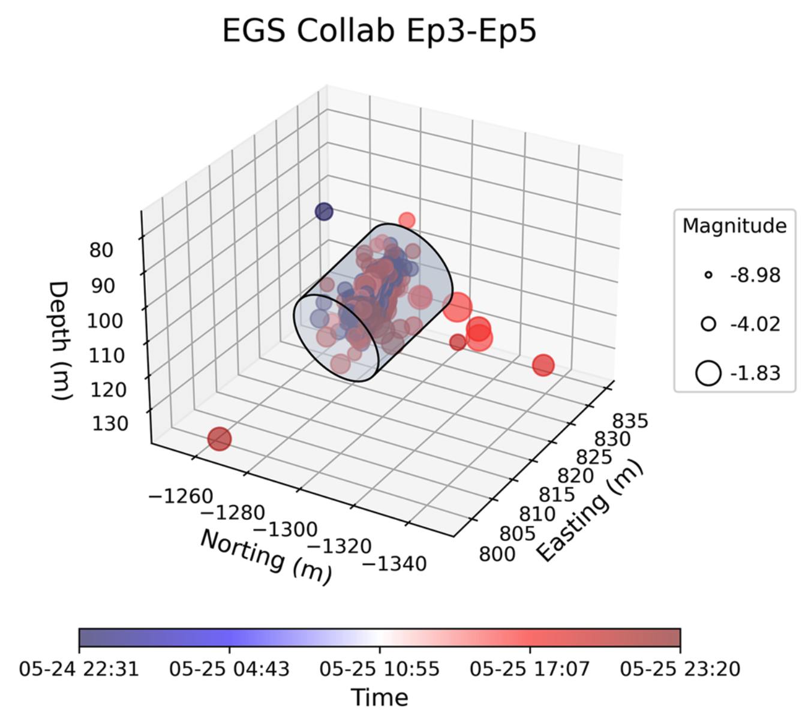

    === "Overview"
        We apply machine learning to geophysical systems involving permeability evolution, microearthquakes, and coupled seismo-thermo-hydro-mechanical-chemical processes. This work aims to connect seismic signals, laboratory measurements, and physical mechanisms in order to better understand subsurface dynamics and enhanced geothermal systems.

    === "Publications"
        - [Crustal Permeability Generated Through Microearthquakes Is Constrained by Seismic Moment (2024)](https://rdcu.be/flrNb)
        - [Evolution of Crustal Permeability as a Coupled Seismo-THMC Process (2025)](https://agu.confex.com/agu/agu25/meetingapp.cgi/Paper/1894046)
        <!-- - [Machine Learning to Connect Permeability Evolution to Microearthquakes in Hydraulic Stimulations for Enhanced Geothermal Systems (2023)]() -->

---

## AI for Health, Vision, and Multimodal Learning

We develop AI systems for biomedical interpretation, visual reasoning, image compression, human motion prediction, and multimodal learning.

- **AI for Health and Clinical Interpretation**

    ---

    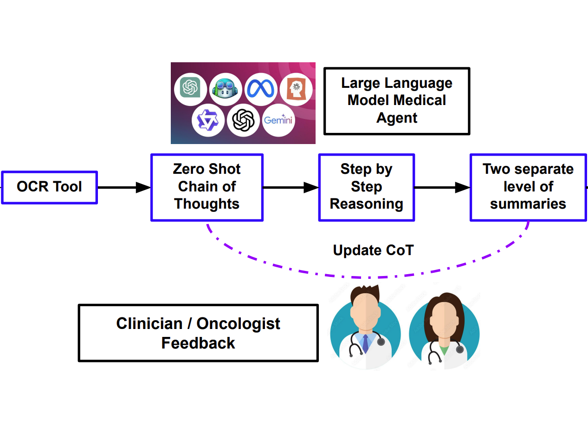

    === "Overview"
        We study how language models and chain-of-thought prompting can support clinical interpretation and patient-centered communication. This includes work on pathology report summarization, cancer report interpretation, and safe deployment of AI systems in health-related workflows.

    === "Publications"
        - [Chain-of-Thought for Cancer Pathology Interpretation and Summarization (2025)](https://doi.org/10.1109/SMARTCOMP65954.2025.00081)

- **Microscopy and Human-in-the-Loop Vision-Language Models**

    ---

    

    === "Overview"
        We study human-in-the-loop methods for selecting prompts and improving microscopy vision-language models. This research focuses on making AI-assisted microscopy more efficient, interpretable, and useful for scientific image analysis.

    === "Publications"
        - [A Human-in-the-Loop Framework for Efficient Prompt Selection in Microscopy Vision-Language Models (2026)](https://arxiv.org/pdf/2605.20495)

- **Image Compression and Neural Decoding**

    ---

    

    === "Overview"
        We develop neural methods for image compression and iterative decoding. This includes recurrent learning algorithms, neural JPEG systems, and gradient communication between estimators. The broader goal is to improve compression efficiency while preserving reconstruction quality and computational tractability.

    === "Publications"
        - [The Sibling Neural Estimator: Improving Iterative Image Decoding with Gradient Communication (2020)](https://doi.org/10.1109/DCC47342.2020.00010)
        - [Neural JPEG: End-to-End Image Compression Leveraging a Standard JPEG Encoder-Decoder (2022)](https://doi.org/10.1109/DCC52660.2022.00082)
        - [An Empirical Analysis of Recurrent Learning Algorithms in Neural Lossy Image Compression Systems (2021)](https://doi.org/10.1109/DCC50243.2021.00073)
        - [Learned Neural Iterative Decoding for Lossy Image Compression Systems (2018)](https://doi.org/10.1109/DCC.2019.00008)

- **Computer Vision and Visually Grounded Learning**

    ---

    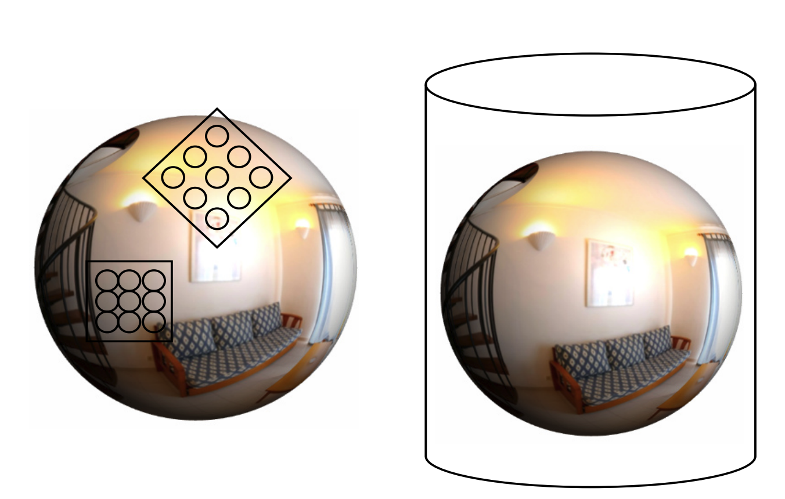

    === "Overview"
        We study visual representation learning, visually grounded language acquisition, human motion prediction, and 3D room layout reconstruction. This work connects perception, language, geometry, and temporal modeling.

    === "Publications"
        - [OmniLayout: Room Layout Reconstruction from Indoor Spherical Panoramas (2021)](https://openaccess.thecvf.com/content/CVPR2021W/OmniCV/papers/Rao_OmniLayout_Room_Layout_Reconstruction_From_Indoor_Spherical_Panoramas_CVPRW_2021_paper.pdf)
        - [A Neural Temporal Model for Human Motion Prediction (2019)](https://openaccess.thecvf.com/content_CVPR_2019/html/Gopalakrishnan_A_Neural_Temporal_Model_for_Human_Motion_Prediction_CVPR_2019_paper.html)
        - [Like a Baby: Visually Situated Neural Language Acquisition (2018)](https://aclanthology.org/P19-1506.pdf)
        - [Like a Bilingual Baby: The Advantage of Visually Grounding a Bilingual Language Model (2022)](https://arxiv.org/pdf/2210.05487)

---

## Patents and Technology Transfer

- **Neural Network Training Technology**

    ---

    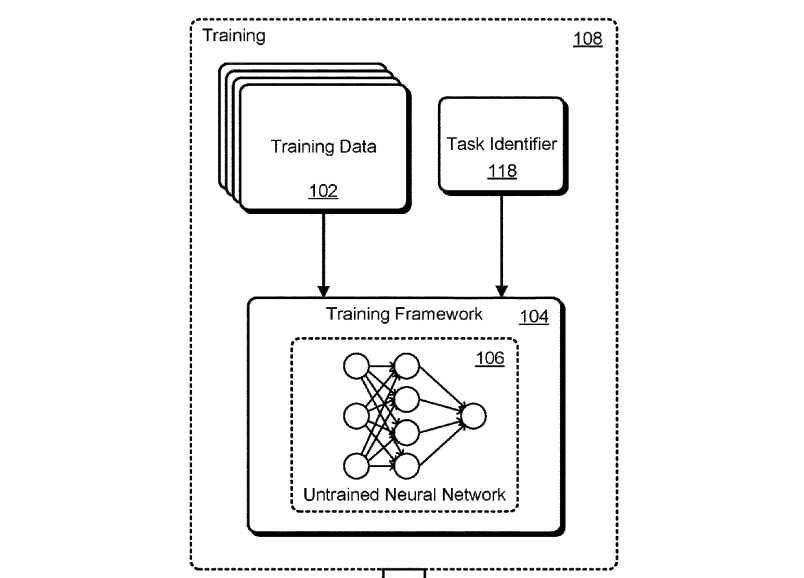

    === "Overview"
        Our research has contributed to patented technology on alternative methods for training neural networks. This reflects the translational potential of biologically motivated and backpropagation-free learning methods for real-world AI systems.

    === "Publications"
        - [Novel Method of Training a Neural Network, US Patent Application 17/520,448 (2023)](https://patents.google.com/patent/US20230146647A1/en)

---

## Additional Research Directions

- **High Performance Computing**

    ---

    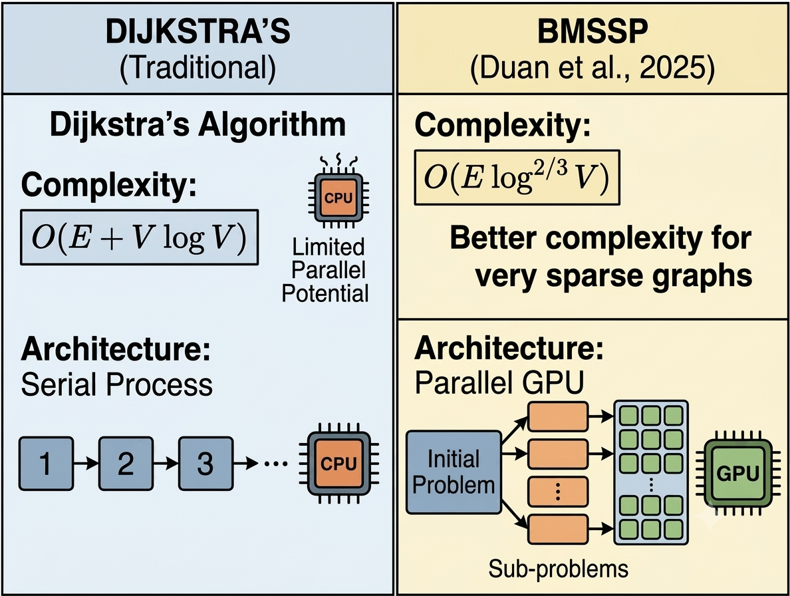

    === "Overview"
        We are exploring GPU-parallel algorithms for graph search and scientific computing. This includes parallel implementations of Bounded Multi-Source Shortest Path methods designed to decompose large search problems into independent subproblems suitable for modern accelerators.

    === "Publications"
        *Work in progress.*

- **Control Systems**

    ---

    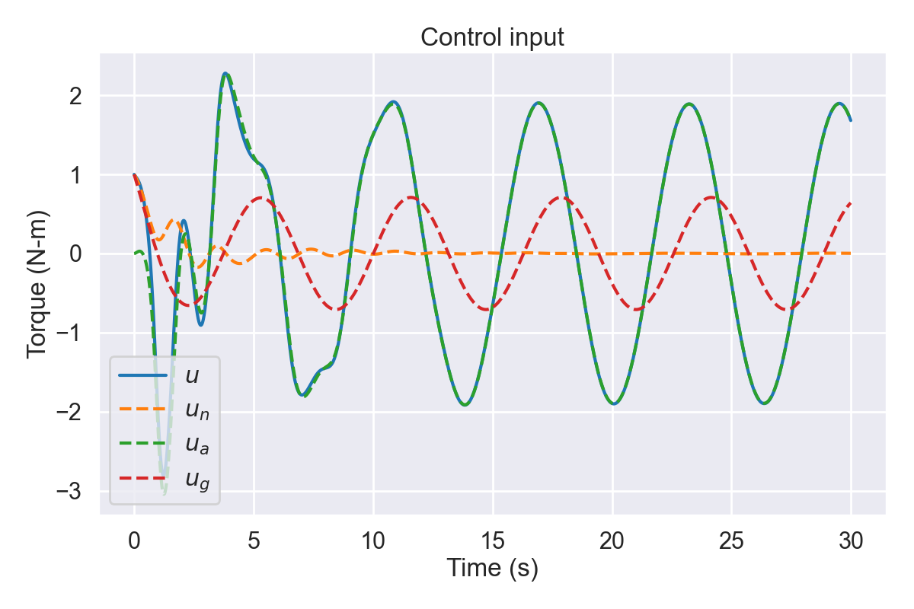

    === "Overview"
        We study optimization-based approaches for adaptive control, including gradient-descent-based MRAC and higher-order extensions. This work connects control theory, stability analysis, and learning-based adaptation.

    === "Publications"
        *Work in progress.*

